# CodeWiki: microsoft/playwright
Source: https://codewiki.google/github.com/microsoft/playwright

## microsoft/playwright

microsoft/playwrightOn this page Browser Automation Core  Playwright Test Runner and API  Playwright for Electron Applications  Interactive Reporting and Debugging Tools  Experimental Component Testing  Playwright Development and Internal Architecture  Browser Specific Configurations and Patches  This wiki was automatically generated  on Apr 22, 2026 based on commit 93273b2. Gemini can make mistakes, so double-check it.

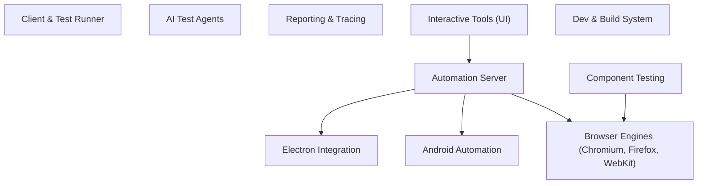
```mermaid
flowchart TD
  Client_Test_Runner["Client & Test Runner"]
  Automation_Server["Automation Server"]
  Component_Testing["Component Testing"]
  AI_Test_Agents["AI Test Agents"]
  Reporting_Tracing["Reporting & Tracing"]
  Interactive_Tools_UI["Interactive Tools (UI)"]
  Browser_Engines_Chromium_Firefox_WebKit["Browser Engines (Chromium, Firefox, WebKit)"]
  Android_Automation["Android Automation"]
  Electron_Integration["Electron Integration"]
  Dev_Build_System["Dev & Build System"]
  Automation_Server --> Browser_Engines_Chromium_Firefox_WebKit
  Automation_Server --> Android_Automation
  Automation_Server --> Electron_Integration
  Component_Testing --> Browser_Engines_Chromium_Firefox_WebKit
  Interactive_Tools_UI --> Automation_Server
```

Playwright automates browser interactions across Chromium, Firefox, and WebKit, and provides a testing framework for web applications. It enables programmatic control over browsers, simulating user actions for end-to-end testing, visual regression, and web scraping. The software delivers a browser automation engine, a test runner, and tooling for development and debugging.
The browser automation components enable direct interaction with different browser engines, manage browser contexts and pages, and support a client-server communication model. This architecture facilitates control over browser behavior, network requests, and JavaScript execution, including specialized automation for Android Device Automation. The Playwright Protocol Definition and Validation defines the contract for this communication. Command-line interface utilities provision and manage browser installations on various operating systems Command-Line Interface Utilities and Browser Provisioning.
The testing framework orchestrates test execution, loads configurations, and manages assertions. It includes an assertion library with matchers for asynchronous web interactions, visual regression, and snapshot testing Playwright Test Assertion Library (expect). The framework supports features such as interactive watch mode, snapshot rebaselining, and a modular plugin system for extending test functionalities Modular Plugin System. Test results are managed by a reporting system, offering various output formats Playwright Test Reporting System. AI agent integration assists in test generation and healing AI Agent Integration for Test Generation and Healing.
Playwright extends its capabilities to automate Playwright for Electron Applications, treating application windows as standard Playwright pages. It also offers Experimental Component Testing for isolating and testing individual UI components across different JavaScript frameworks.
For debugging and analysis, Playwright provides interactive tools. An HTML reporter generates detailed, interactive test results. A Trace Viewer allows post-mortem analysis of test execution traces, including action lists, console logs, network activity, and visual snapshots. The Playwright Inspector aids in recording user interactions, inspecting DOM elements, and generating code Interactive Reporting and Debugging Tools.
The project's Playwright Development and Internal Architecture sections guide contributors through API design, internal tool development, and the build and deployment processes. Browser-specific configurations and patches ensure consistent behavior across different browser engines Browser Specific Configurations and Patches.
This section introduces the foundational components of Playwright that enable browser automation without bundling a browser itself. It defines the core types, client-side APIs, and server implementations necessary for orchestrating browser interactions, along with command-line tools for managing browser installations and environments. The packages/playwright-core directory houses these essential elements, providing the backbone for Playwright's automation capabilities.
At its core, Playwright defines a robust set of types and interfaces in packages/playwright-core/types that establish the contract between the automation client and the browser. This includes definitions for interacting with pages, managing evaluation contexts, and handling various browser events. These types ensure consistency and type-safety throughout the automation process.
The client-side APIs, located in packages/playwright-core/src/client, provide the programmatic interface for users to interact with browsers. These APIs manage the connection to the browser backend, orchestrate the lifecycle of browser contexts and pages, and facilitate high-level interactions like clicking elements, navigating, and executing JavaScript. Communication between the client and the server is handled via a client-server architecture. This includes managing message serialization, object lifecycle, and various transport mechanisms, as further detailed in Core Client-Server Communication Architecture.
On the server side, packages/playwright-core/src/server contains the logic for managing different browser types (Chromium, Firefox, WebKit), their launch parameters, and the lifecycle of browser contexts. This includes resource management, persistent contexts, and handling connections. This server-side infrastructure is responsible for translating client commands into browser-specific actions and relaying results back to the client. Detailed management of browser types and contexts is discussed in Browser Type and Context Lifecycle Management.
Playwright's command-line interface (CLI), with its entry point at packages/playwright-core/cli.js and implementation in packages/playwright-core/src/cli, provides tools for managing browser installations and dependencies. This includes automated scripts for installing and reinstalling various browser channels (e.g., Chrome, Edge) across different operating systems, ensuring the necessary environment is set up for automation. For instance, scripts like packages/playwright-core/bin/reinstall_chrome_beta_linux.sh, packages/playwright-core/bin/reinstall_msedge_stable_win.ps1, and packages/playwright-core/bin/install_webkit_wsl.ps1 handle platform-specific installation details. The CLI also facilitates other operations such as code generation, taking screenshots, and running Playwright servers. Further details on these utilities are available in Command-Line Interface Utilities and Browser Provisioning.
Beyond browser automation, this core package also includes infrastructure for working with Android devices, as described in Android Device Automation, and integrates with the WebDriver BiDi protocol for enhanced browser control, elaborated in WebDriver BiDi Protocol Integration. The fundamental tools and internal infrastructure supporting Playwright's operations are explored in Core Tooling and Infrastructure.


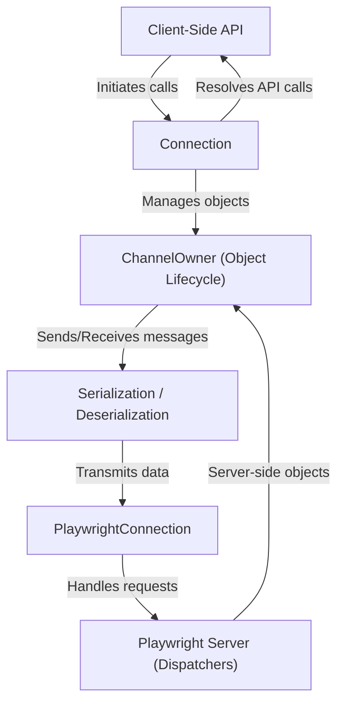
```mermaid
flowchart TD
  ClientAPI["Client-Side API"]
  Connection["Connection"]
  ChannelOwner["ChannelOwner (Object Lifecycle)"]
  Serialization["Serialization / Deserialization"]
  ServerConnection["PlaywrightConnection"]
  PlaywrightServer["Playwright Server (Dispatchers)"]
  ClientAPI -->|"Initiates calls"| Connection
  Connection -->|"Resolves API calls"| ClientAPI
  Connection -->|"Manages objects"| ChannelOwner
  ChannelOwner -->|"Sends/Receives messages"| Serialization
  Serialization -->|"Transmits data"| ServerConnection
  ServerConnection -->|"Handles requests"| PlaywrightServer
  PlaywrightServer -->|"Server-side objects"| ChannelOwner
```

Playwright's architecture for browser automation relies on a robust client-server communication model that separates the client-side API, which users interact with, from the server-side browser automation logic. This design allows for flexible deployment, including remote execution, and ensures stable interactions with various browser engines without embedding the browser directly into the client application.
At the core of this architecture, the Connection class in packages/playwright-core/src/client/connection.ts orchestrates all client-server interactions. It manages the bidirectional flow of messages, handles the serialization and deserialization of data, and dynamically creates client-side representations for remote objects. Each client-side object, such as a Browser or Page, is an instance of ChannelOwner (defined in packages/playwright-core/src/client/channelOwner.ts). These ChannelOwner objects act as proxies, forwarding API calls and receiving events from their corresponding server-side components. The ChannelOwner also manages its lifecycle, including event subscriptions, ensuring that protocol events are only sent from the server when actively listened to by the client.
The communication channel itself is established and managed by utilities like connectToBrowser in packages/playwright-core/src/client/connect.ts. This function sets up the low-level connection using various transport mechanisms, including WebSockets (via WebSocketTransport) or named pipes (via JsonPipeTransport). It ensures that the client can connect to either a locally spawned browser or a remote Playwright server, handling connection parameters, timeouts, and the graceful closure of resources upon disconnection. On the server side, the PlaywrightConnection in packages/playwright-core/src/remote/playwrightConnection.ts receives these connections and dispatches messages, managing the lifecycle of server-side browser objects and ensuring concurrency control.
Key aspects of this client-server interaction include:

Object Lifecycle Management: The Connection tracks remote objects using unique GUIDs, dynamically instantiating the correct ChannelOwner subclass on the client as objects are created on the server. This ensures that client-side objects accurately reflect the state and capabilities of their server-side counterparts.
Message Serialization and Validation: API calls from the client are validated against a protocol schema and serialized before being sent to the server. Similarly, incoming messages from the server are deserialized and validated, ensuring data integrity and type consistency across the communication boundary.
Event-Driven Architecture: The client-side ChannelOwner objects extend EventEmitter, allowing them to subscribe to and emit events originating from the server. This enables the client to react asynchronously to browser events like page navigations, dialogs, or network requests.
Error Handling and Stack Tracing: The _wrapApiCall method within ChannelOwner plays a crucial role in enhancing error messages with context-specific details, logging API calls, and capturing client-side stack traces using captureLibraryStackTrace in packages/playwright-core/src/client/clientStackTrace.ts. This provides more informative debugging output for developers.
Instrumentation: A client-side instrumentation system, defined by ClientInstrumentation in packages/playwright-core/src/client/clientInstrumentation.ts, allows for hooks into various events, including API call initiation and completion, providing telemetry and extensibility.

Overall, this architecture provides a robust, scalable, and debuggable foundation for Playwright's automation capabilities, enabling seamless interaction with browsers regardless of their deployment location. Further details on specific browser operations can be found in Browser Type and Context Lifecycle Management. For how these interactions manifest within the Android ecosystem, refer to Android Device Automation.


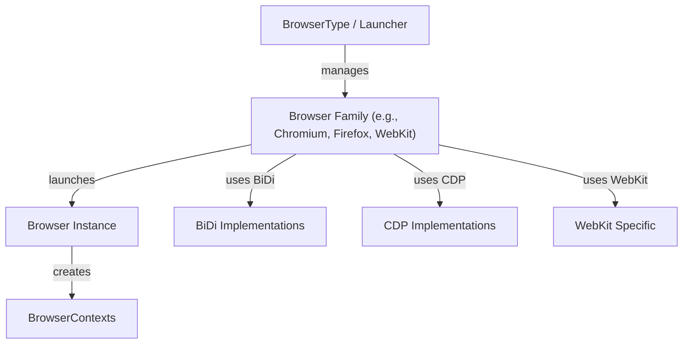
```mermaid
flowchart TD
  BrowserTypeLauncher["BrowserType / Launcher"]
  BrowserFamily["Browser Family (e.g., Chromium, Firefox, WebKit)"]
  BrowserInstance["Browser Instance"]
  BidiImplementations["BiDi Implementations"]
  CDPImplementations["CDP Implementations"]
  WebKitSpecific["WebKit Specific"]
  BrowserContexts["BrowserContexts"]
  BrowserTypeLauncher -->|"manages"| BrowserFamily
  BrowserFamily -->|"launches"| BrowserInstance
  BrowserFamily -->|"uses BiDi"| BidiImplementations
  BrowserFamily -->|"uses CDP"| CDPImplementations
  BrowserFamily -->|"uses WebKit"| WebKitSpecific
  BrowserInstance -->|"creates"| BrowserContexts
```

Playwright's server-side architecture for browser automation centers around the management of different browser types and their associated contexts. This involves launching and connecting to browsers like Chromium, Firefox, and WebKit, configuring their startup parameters, and overseeing the entire lifecycle of isolated browsing sessions, including resource management, persistent contexts, and connection handling.
The abstract BrowserType class, defined in packages/playwright-core/src/server/browserType.ts, serves as the foundation for handling various browser engines. It provides a consistent interface for launching new browser instances and persistent browser contexts, managing their executable paths, and preparing arguments for their launch. Subclasses of BrowserType implement browser-specific logic, such as modifying environment variables or rewriting startup logs, ensuring that each browser type is launched and managed appropriately. The browser launch process involves preparing necessary arguments, executable paths, and temporary directories for user data and artifacts. Communication with the launched browser process is established via a transport layer, which can be either WebSocket-based or pipe-based, abstracting away the underlying communication mechanism.
Once a browser instance is launched, it is managed by an abstract Browser class, found in packages/playwright-core/src/server/browser.ts. This class handles the browser's lifecycle, including closing and killing the process. It is also responsible for creating new BrowserContext instances, which represent isolated browsing sessions. The Browser class supports tracking file downloads and integrating with a communication server to allow external clients to interact with the browser.
The BrowserContext class, defined in packages/playwright-core/src/server/browserContext.ts, is central to managing these isolated sessions. Each context can contain multiple Page objects and provides isolation for network requests, storage (cookies, local storage, IndexedDB), and permissions. This isolation is crucial for testing, as it prevents interference between different test scenarios. The BrowserContext enables manipulation of network behavior, such as adding request interceptors and setting HTTP headers, and allows for granting or clearing browser permissions for specific origins. It also facilitates injecting scripts that run before page load and exposing JavaScript functions to the pages, enabling communication between the Playwright environment and the page's JavaScript context. A significant feature is the ability to capture and restore the storage state of a context, which is vital for testing session persistence. To optimize performance, BrowserContext instances can be reset and reused, minimizing the overhead of creating entirely new contexts for repeated tests.
Chromium-specific implementations, located in packages/playwright-core/src/server/chromium, extend these core concepts. The Chromium class, which is a subclass of BrowserType, manages Chromium instances and leverages the Chromium DevTools Protocol (CDP) for low-level communication. It handles specific Chromium launch arguments and provides implementations for tracing and other features. The CRBrowser and CRBrowserContext classes extend their generic counterparts to provide Chromium-specific context management, including cookie handling, permission management, and geolocation. The CRConnection in packages/playwright-core/src/server/chromium/crConnection.ts manages the low-level CDP communication, orchestrating sessions for executing commands and processing events within the browser.
For managing Android devices, the packages/playwright-core/src/server/android directory provides the necessary architecture. The Android class manages connected Android devices, enabling operations like executing shell commands, taking screenshots, installing APKs, and launching browsers or connecting to web views on the device. Communication with Android devices is handled through an ADB backend, which facilitates device discovery and persistent socket connections. An on-device UI automation server further allows for interaction with UI elements, translating Playwright actions into native Android UI operations. See Android Device Automation for more details.
Furthermore, Playwright supports the WebDriver BiDirectional (BiDi) protocol, with implementations detailed in packages/playwright-core/src/server/bidi. The BidiConnection class establishes and maintains a BiDi connection, routing messages to specific sessions. The BidiBrowser and BidiBrowserContext classes extend Playwright's base browser and context functionalities to work with the BiDi protocol, handling network management, input emulation, and JavaScript execution via BiDi commands. This includes browser-specific implementations like BidiChromium, which bridges CDP to BiDi, and BidiFirefox for Firefox-specific profile and launch management. See WebDriver BiDi Protocol Integration for more details.


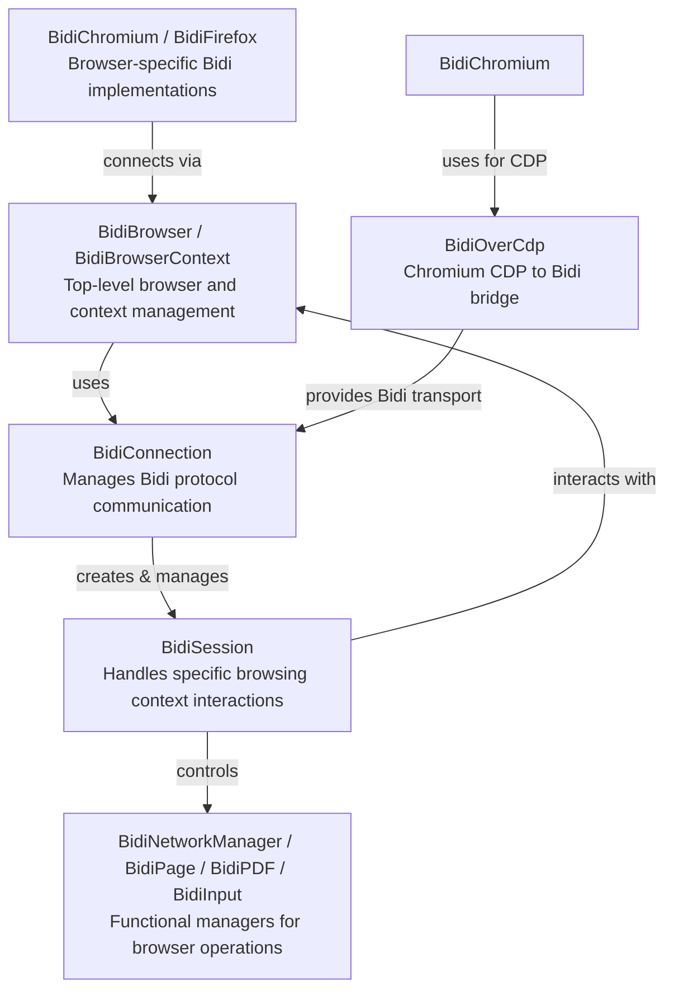
```mermaid
flowchart TD
  BrowserTypes["BidiChromium / BidiFirefox<br/>Browser-specific Bidi implementations"]
  BidiBrowser["BidiBrowser / BidiBrowserContext<br/>Top-level browser and context management"]
  BidiConnection["BidiConnection<br/>Manages Bidi protocol communication"]
  BidiSession["BidiSession<br/>Handles specific browsing context interactions"]
  BidiManagers["BidiNetworkManager / BidiPage / BidiPDF / BidiInput<br/>Functional managers for browser operations"]
  BidiChromium["BidiChromium"]
  BidiOverCdp["BidiOverCdp<br/>Chromium CDP to Bidi bridge"]
  BrowserTypes -->|"connects via"| BidiBrowser
  BidiBrowser -->|"uses"| BidiConnection
  BidiConnection -->|"creates & manages"| BidiSession
  BidiSession -->|"interacts with"| BidiBrowser
  BidiSession -->|"controls"| BidiManagers
  BidiChromium -->|"uses for CDP"| BidiOverCdp
  BidiOverCdp -->|"provides Bidi transport"| BidiConnection
```

Playwright implements the WebDriver BiDi (Bidirectional) protocol to enable robust and standardized communication with browsers. This integration establishes a direct, low-level connection to the browser's internal mechanisms, facilitating fine-grained control over various browser operations.
The core of this integration involves managing the BiDi connection and sessions. The BidiConnection class in packages/playwright-core/src/server/bidi/bidiConnection.ts handles the overarching connection to the browser, dispatching incoming BiDi messages and routing them to the appropriate BidiSession instances. A BidiSession represents a logical unit of interaction, often tied to a browser context (like a tab or an iframe) or the browser itself. This separation allows for independent management of different scopes within the browser, ensuring that events and commands are correctly attributed and processed. The system uses a mapping of browsing contexts and realms to sessions to ensure proper routing of events, especially from non-window realms such as dedicated workers.
To support various browser types, Playwright provides specific implementations. For Chromium, the BidiChromium class in packages/playwright-core/src/server/bidi/bidiChromium.ts extends BrowserType to manage Chromium-specific interactions. Since Chromium does not natively expose a BiDi endpoint, Playwright employs a bridge that translates between the existing Chrome DevTools Protocol (CDP) and BiDi, enabling BiDi-based automation for Chromium. In contrast, for Firefox, the BidiFirefox class in packages/playwright-core/src/server/bidi/bidiFirefox.ts provides Firefox-specific capabilities, including environment setup and argument generation, connecting directly to Firefox's native BiDi support.
This protocol integration enables comprehensive control over browser operations:

Browser and Context Lifecycle Management: The BidiBrowser and BidiBrowserContext classes in packages/playwright-core/src/server/bidi/bidiBrowser.ts manage the creation, configuration, and destruction of browser instances and their associated contexts. This includes setting viewport sizes, emulating various device conditions, managing permissions, and handling persistent contexts.
Page-level Operations: The BidiPage class in packages/playwright-core/src/server/bidi/bidiPage.ts translates Playwright's page interactions into BiDi commands. This covers functionalities such as navigating frames, updating HTTP headers, handling dialogs, taking screenshots, generating PDFs, and managing initialization scripts. It relies heavily on listening to BiDi session events to maintain an accurate representation of the page's state, including its frame hierarchy and lifecycle events.
Network Handling: Network requests and responses are managed by the BidiNetworkManager in packages/playwright-core/src/server/bidi/bidiNetworkManager.ts. This component listens for BiDi network events and translates them into Playwright's internal network abstractions. It supports advanced features like request interception, allowing Playwright to modify or fulfill network requests, handle HTTP authentication, and manage CORS preflight requests.
Input Emulation: Playwright's input actions are translated into BiDi protocol messages for keyboard, mouse, and touchscreen interactions. The implementations in packages/playwright-core/src/server/bidi/bidiInput.ts provide methods to simulate keydown, keyup, sendText, mouse movements, clicks, and wheel events by constructing and sending input.performActions commands through the BiDi session.
JavaScript Execution: The BidiExecutionContext in packages/playwright-core/src/server/bidi/bidiExecutionContext.ts facilitates JavaScript execution within the browser's context. It provides an interface for evaluating expressions, calling functions, and manipulating JavaScript objects and DOM elements remotely. This is crucial for interacting with the page's dynamic content and extending automation capabilities. The system also includes BidiSerializer and deserializeBidiValue from packages/playwright-core/src/server/bidi/bidiDeserializer.ts for converting JavaScript values to and from BiDi-compatible formats, including handling circular references and object identity.

The BiDi protocol's definitions and utilities are consolidated in the packages/playwright-core/src/server/bidi/third_party directory. This includes core protocol types, command manifests, serialization logic, and keyboard input mappings, ensuring a standardized and type-safe approach to BiDi communication.


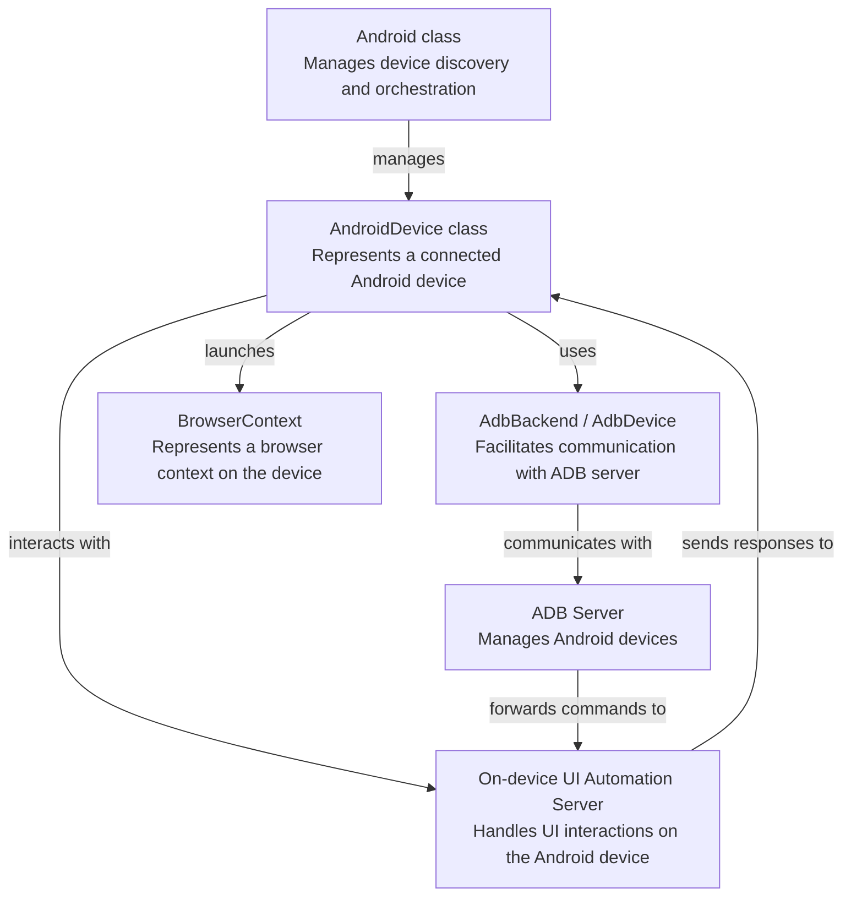
```mermaid
flowchart TD
  Android["Android class<br/>Manages device discovery and orchestration"]
  AndroidDevice["AndroidDevice class<br/>Represents a connected Android device"]
  AdbBackendDevice["AdbBackend / AdbDevice<br/>Facilitates communication with ADB server"]
  OnDeviceAutomationServer["On-device UI Automation Server<br/>Handles UI interactions on the Android device"]
  BrowserContext["BrowserContext<br/>Represents a browser context on the device"]
  AdbServer["ADB Server<br/>Manages Android devices"]
  Android -->|"manages"| AndroidDevice
  AndroidDevice -->|"uses"| AdbBackendDevice
  AndroidDevice -->|"interacts with"| OnDeviceAutomationServer
  AndroidDevice -->|"launches"| BrowserContext
  AdbBackendDevice -->|"communicates with"| AdbServer
  AdbServer -->|"forwards commands to"| OnDeviceAutomationServer
  OnDeviceAutomationServer -->|"sends responses to"| AndroidDevice
```

Playwright provides capabilities for automating Android devices, enabling interaction with the device's UI and managing applications. This functionality is built upon an architecture that facilitates device discovery, communication via the Android Debug Bridge (ADB) protocol, and an on-device UI automation server.
The core of Android device management is handled by the Android class in packages/playwright-core/src/server/android/android.ts, which orchestrates the discovery and lifecycle of connected Android devices. Each connected device is represented by an AndroidDevice instance, offering methods to execute shell commands, take screenshots, install and push files (APKs), and launch/connect to browsers and web views. For example, launchBrowser allows for starting a browser like Chrome on the device and establishing a DevTools connection for automation. The _installDriver method within AndroidDevice is responsible for ensuring the necessary Playwright Android driver APKs are installed and running on the device, providing a reliable communication channel.
Communication with Android devices primarily relies on an ADB backend, implemented by the AdbBackend and AdbDevice classes in packages/playwright-core/src/server/android/backendAdb.ts. The AdbBackend handles device discovery, returning a list of available AdbDevice instances. Each AdbDevice can then execute specific ADB commands using runCommand or establish persistent socket connections via open, which is crucial for continuous data exchange. Message encoding for ADB communication is managed by encodeMessage, ensuring proper formatting. A BufferedSocketWrapper wraps standard network sockets to provide buffered reading and writing, improving the robustness of ADB interactions.
A significant component of Android automation is the on-device UI automation server, located within the packages/playwright-core/src/server/android/driver directory. This server, implemented as an Android instrumented test in packages/playwright-core/src/server/android/driver/app/src/androidTest/java/com/microsoft/playwright/androiddriver/InstrumentedTest.java, operates by setting up a local socket named "playwright_android_driver_socket". It processes JSON-formatted commands received over this socket, leveraging Android's UiDevice to interact with the device's user interface. The server dispatches these commands to methods for tasks such as:

Selector Parsing: The parseSelector method interprets JSON objects into BySelector instances, allowing for complex UI element identification based on various properties like text, class, or content description.
UI Actions: Methods like fill, click, drag, fling, longClick, pinchClose, pinchOpen, scroll, and swipe enable direct interaction with located UI elements.
Element Information: The info method retrieves detailed properties of UI elements, such as their class, package, description, text, and bounding box.
UI Hierarchy Tree Generation: The tree method generates a JSON representation of the entire UI element hierarchy, useful for understanding the structure of the application's interface.

This architecture allows Playwright to discover Android devices, manage their applications, and precisely control their UI elements, providing a robust platform for mobile automation.


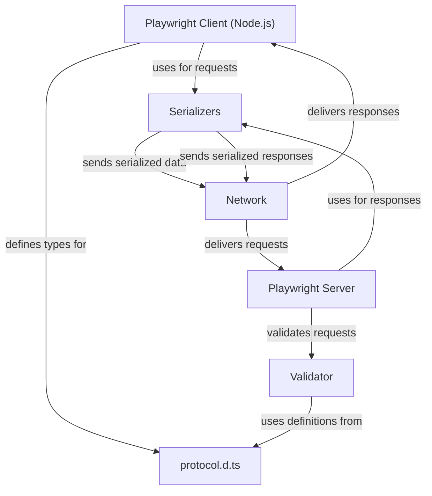
```mermaid
flowchart TD
  Client["Playwright Client (Node.js)"]
  ProtocolDefinitions["protocol.d.ts"]
  Serialization["Serializers"]
  Transmission["Network"]
  Server["Playwright Server"]
  Validation["Validator"]
  Client -->|"defines types for"| ProtocolDefinitions
  Client -->|"uses for requests"| Serialization
  Serialization -->|"sends serialized data"| Transmission
  Serialization -->|"sends serialized responses"| Transmission
  Transmission -->|"delivers responses"| Client
  Transmission -->|"delivers requests"| Server
  Server -->|"uses for responses"| Serialization
  Server -->|"validates requests"| Validation
  Validation -->|"uses definitions from"| ProtocolDefinitions
```

Playwright's client-server architecture relies on a well-defined protocol for communication between the automation client (Node.js) and the browser automation server. This protocol is meticulously defined and validated to ensure type safety and consistency across various operations.
The core of the protocol definition resides in the TypeScript type definitions within the packages/playwright-core/types directory. Specifically, packages/playwright-core/types/protocol.d.ts outlines the data structures, command parameters, return values, and event payloads for numerous browser domains, including Accessibility, Animation, Audits, Autofill, Bluetooth Emulation, and general Browser management. These definitions provide a contract for how data should be structured for both requests and responses. For example, within the Browser domain, BrowserContextID, WindowID, and WindowState define identifiers and states for browser contexts and windows, while PermissionType and PermissionSetting specify permission management. The file also includes types for commands such as setPermission, grantPermissions, close, and events like downloadWillBeginPayload.
Beyond browser-specific domains, packages/playwright-core/types/structs.d.ts defines fundamental structures crucial for cross-context operations, including Serializable for JSON-compatible data, EvaluationArgument for arguments passed to browser-evaluated functions (which can include JSHandle instances), and Unboxed<Arg> for recursively extracting underlying JavaScript types from JSHandle or ElementHandle objects. These types are essential for maintaining type integrity when executing code within the browser context from the client. The Page interface, defined in packages/playwright-core/types/types.d.ts, brings these definitions together, offering a comprehensive API for interacting with browser tabs, including JavaScript evaluation, DOM interaction, event handling, and various utility methods.
To enable this communication, Playwright uses serialization and deserialization utilities found in packages/playwright-core/src/protocol/serializers.ts. This module is responsible for converting a wide range of JavaScript data types—from primitives and built-in objects like Date, URL, Error, and RegExp to complex objects and arrays—into a SerializedValue format suitable for transport between client and server. The utilities incorporate mechanisms for detecting and handling circular references within objects, ensuring that complex data structures can be faithfully transmitted and reconstructed. A key feature is the ability to represent objects as "handles" rather than fully serializing them, which is critical for referencing objects that reside in a different execution context.
Ensuring the integrity and correctness of this communication is the role of the validation schemes. The packages/playwright-core/src/protocol/validator.ts file (which is auto-generated) contains comprehensive data validation schemes for the entire Playwright protocol. It populates a global scheme object with schemas for requests, responses, events, and various data types. These schemas are built using primitive validators defined in packages/playwright-core/src/protocol/validatorPrimitives.ts, which includes basic type checkers (tString, tInt, tBoolean) and compound validators (tObject, tArray, tEnum, tChannel, tType). This layered validation system ensures that all messages exchanged adhere to the expected structure and types, preventing inconsistencies and errors in browser automation. The ValidatorContext in packages/playwright-core/src/protocol/validatorPrimitives.ts further allows for context-aware validation, such as handling binary data differently or enabling test-specific behaviors.


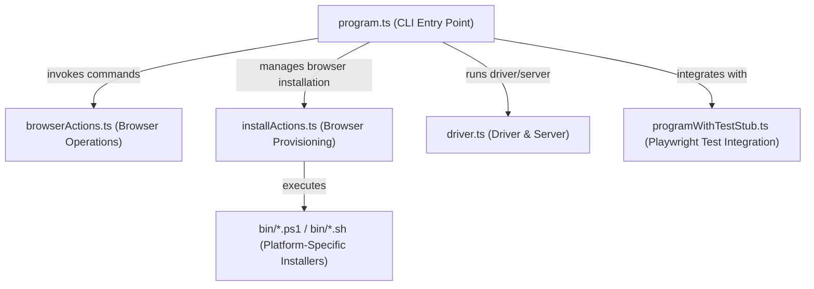
```mermaid
flowchart TD
  PlaywrightCLI["program.ts (CLI Entry Point)"]
  BrowserActions["browserActions.ts (Browser Operations)"]
  InstallActions["installActions.ts (Browser Provisioning)"]
  DriverCore["driver.ts (Driver & Server)"]
  TestIntegration["programWithTestStub.ts (Playwright Test Integration)"]
  BinScripts["bin/*.ps1 / bin/*.sh (Platform-Specific Installers)"]
  PlaywrightCLI -->|"invokes commands"| BrowserActions
  PlaywrightCLI -->|"manages browser installation"| InstallActions
  PlaywrightCLI -->|"runs driver/server"| DriverCore
  PlaywrightCLI -->|"integrates with"| TestIntegration
  InstallActions -->|"executes"| BinScripts
```

The Playwright Command-Line Interface (CLI) extends beyond basic test execution to provide robust tools for managing browser installations, handling system dependencies, and facilitating environment setup for various browser types. This functionality is crucial for ensuring Playwright's portability and ease of use across different operating systems and continuous integration (CI) environments.
The primary entry point for configuring the Playwright CLI is within packages/playwright-core/src/cli/program.ts, which uses the commander library to define and manage various subcommands and options. This setup enables a wide range of browser-related actions, from launching browsers to generating code and capturing visual outputs.
A key aspect of the CLI's role is its browser provisioning capabilities, managed largely through the actions defined in packages/playwright-core/src/cli/installActions.ts. This component provides commands for installing, uninstalling, and listing browsers, alongside the ability to install only the necessary system dependencies without the full browser installation. This modularity is particularly useful in environments where browser binaries might be pre-installed or custom-managed. The installBrowsers function, for instance, not only handles the installation process but also includes logic to warn users about common npx usage pitfalls and validates host requirements post-installation.
The actual browser re-installation processes for specific browsers like Chrome, Edge, and WebKit across different operating systems (Windows, macOS, Linux) are encapsulated in shell and PowerShell scripts found in the packages/playwright-core/bin directory. These scripts perform tasks such as:

Platform-specific Installation: Scripts like packages/playwright-core/bin/reinstall_chrome_beta_linux.sh and packages/playwright-core/bin/reinstall_chrome_beta_mac.sh handle the download, silent installation, and verification of Chrome Beta on Linux and macOS, respectively. Similar scripts exist for Chrome Stable, Edge Beta, Dev, and Stable across all three major operating systems. These scripts leverage native package managers (e.g., apt-get on Linux, hdiutil on macOS, msiexec.exe on Windows) and command-line tools like curl for robust and automated installations.
Environment Setup: Beyond browser binaries, the CLI facilitates environment-specific setups. For example, packages/playwright-core/bin/install_webkit_wsl.ps1 automates the configuration of a Windows Subsystem for Linux (WSL) environment for WebKit, including Node.js installation and Playwright dependency management within the WSL instance. Additionally, packages/playwright-core/bin/install_media_pack.ps1 ensures that necessary Windows features, such as Media Foundation, are installed on Windows Server operating systems when required.

The CLI also supports core driver operations and server management, as detailed in packages/playwright-core/src/cli/driver.ts. This includes functions to execute the Playwright driver for inter-process communication and to launch a Playwright server or a browser-specific server, offering flexible deployment options for automation.
Furthermore, the CLI integrates with Playwright Test to provide a unified experience. The packages/playwright-core/src/cli/programWithTestStub.ts file is responsible for gracefully handling scenarios where Playwright Test commands are invoked without the necessary @playwright/test package installed, guiding users with appropriate installation instructions. This helps maintain a smooth developer workflow, even when dependencies are not fully met.
The CLI's design emphasizes modularity and platform-specific adaptations, ensuring that Playwright can consistently provision and manage browser environments across diverse operating systems and usage scenarios.


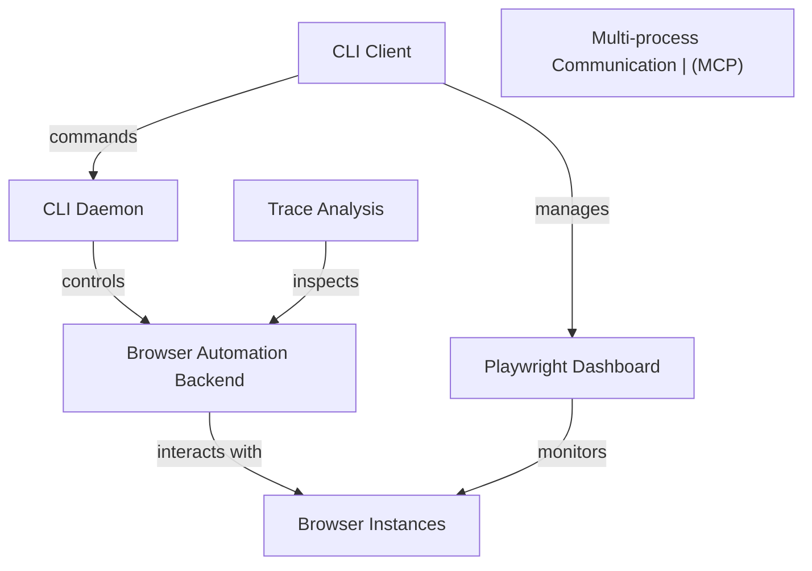
```mermaid
flowchart TD
  CLI_Client["CLI Client"]
  CLI_Daemon["CLI Daemon"]
  Playwright_Dashboard["Playwright Dashboard"]
  Browser_Automation_Backend["Browser Automation Backend"]
  Browser_Instances["Browser Instances"]
  Multi_process_Communication_MCP["Multi-process Communication | (MCP)"]
  Trace_Analysis["Trace Analysis"]
  CLI_Client -->|"commands"| CLI_Daemon
  CLI_Client -->|"manages"| Playwright_Dashboard
  CLI_Daemon -->|"controls"| Browser_Automation_Backend
  Browser_Automation_Backend -->|"interacts with"| Browser_Instances
  Playwright_Dashboard -->|"monitors"| Browser_Instances
  Trace_Analysis -->|"inspects"| Browser_Automation_Backend
```

Playwright's operations are supported by a suite of fundamental tools and internal infrastructure components that handle browser automation, command-line interactions, daemon services, multi-process communication (MCP) management, and trace analysis.
The system's browser automation backend is provided by the directory packages/playwright-core/src/tools/backend. It defines a modular architecture where various "tools" encapsulate specific functionalities, operating on a Playwright BrowserContext or Page. A BrowserBackend orchestrates these tools, managing their invocation, argument parsing, session logging, and response serialization. This includes tools for browser control (e.g., closing and resizing the browser, managing tabs), navigation, UI interaction (e.g., clicking, filling forms, keyboard and mouse input), debugging (e.g., console message retrieval, network inspection, tracing), storage management (e.g., cookies, local storage), and content capture (e.g., screenshots, PDF generation).
The command-line interface (CLI) client, located in packages/playwright-core/src/tools/cli-client, provides the interface for users to interact with Playwright sessions. It manages the parsing of command-line arguments, execution of commands, and formatting of output. The CLI client also handles session management, including persisting daemon session configurations and discovering active browser sessions. A variety of commands are available for browser management, navigation, element interaction, state and storage manipulation, network interception, code evaluation, and debugging.
The CLI daemon, found in packages/playwright-core/src/tools/cli-daemon, offers an API for browser automation via inter-process communication mechanisms such as Unix sockets or named pipes. It defines schemas for commands using zod for robust validation and includes a daemon server that listens for client connections, translating client requests into tool execution within the BrowserBackend. The daemon also manages CLI program initialization, ensuring necessary browsers are installed and workspaces are set up, and facilitates the generation of help documentation.
Multi-process communication (MCP) is managed by the code in packages/playwright-core/src/tools/mcp. This component is responsible for creating and connecting Playwright browser backend servers, supporting various browser configurations. It handles launching and managing different browser instances, including isolated, persistent, and remote browsers, and integrates with browser extensions via a CDP relay. Configuration management is a central aspect, allowing settings to be loaded, merged, and validated from multiple sources such as INI/JSON files, environment variables, and CLI options.
Trace analysis is supported by the CLI tools within packages/playwright-core/src/tools/trace. This functionality allows users to inspect .zip trace files generated by Playwright without requiring a browser. Commands are available to analyze actions, network requests, console messages, errors, DOM snapshots, screenshots, and attachments from a test run. The system handles the extraction and loading of trace data, providing an active context for querying various aspects of the trace.
A collection of low-level utilities in packages/playwright-core/src/tools/utils supports these operations. This includes functionalities for connecting to Playwright browsers across different versions, managing constants related to the Playwright Chrome extension, and implementing robust socket-based communication for line-delimited JSON messages with semantic version comparison capabilities. The MCP server functionality within these utilities supports both HTTP and standard I/O transports for tool discovery and execution, enabling flexible communication between clients and backend tools.
Entry points for these various tools are located in packages/playwright-core/src/entry. These files are responsible for initializing and launching specific components, such as the CLI daemon, the Playwright Dashboard application, the MCP server, and the out-of-process download browser component. The packages/playwright-core/src/tools/dashboard directory specifically focuses on the Playwright Dashboard application, which launches and manages a dedicated Chromium instance to display a UI for monitoring and interacting with Playwright browser sessions. This dashboard provides real-time updates on browser states, allows tab and page management, and supports interactive features like input simulation and locator picking. The overall structure provides a clear separation of concerns, enabling focused development and maintenance of each component.


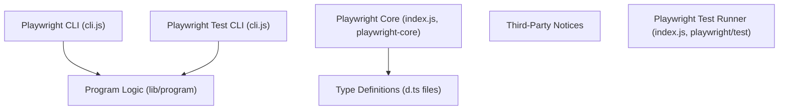
```mermaid
flowchart TD
  Playwright_CLI["Playwright CLI (cli.js)"]
  Program_Logic_lib_program["Program Logic (lib/program)"]
  Playwright_Test_CLI["Playwright Test CLI (cli.js)"]
  Playwright_Core_playwright_js["Playwright Core (index.js, playwright-core)"]
  Third_Party_Notices["Third-Party Notices"]
  Type_Definitions_d_ts_files["Type Definitions (d.ts files)"]
  Playwright_Test_Runner_playwright_test_js["Playwright Test Runner (index.js, playwright/test)"]
  Playwright_CLI --> Program_Logic_lib_program
  Playwright_Test_CLI --> Program_Logic_lib_program
  Playwright_Core_playwright_js --> Type_Definitions_d_ts_files
```

This section describes the Playwright package, which bundles the core browser automation capabilities with the Playwright Test runner. It serves as the primary entry point for integrating Playwright's functionalities into testing workflows.
The package handles command-line argument parsing, providing an interface for users to control test execution and reporting. The CLI entry point, packages/playwright/cli.js and packages/playwright-test/cli.js, leverages a program utility for this purpose, allowing users to run tests, show reports, or merge reports.
For third-party software compliance, the package manages licensing information through packages/playwright/ThirdPartyNotices.txt. This file details how licenses for bundled npm packages are provided alongside the JavaScript output, ensuring transparency regarding included third-party components.
The package also provides comprehensive type definitions for both Playwright's core automation APIs and its testing framework. The file packages/playwright/index.d.ts re-exports all declarations from playwright-core, making core functionalities directly accessible. Similarly, packages/playwright/test.d.ts and packages/playwright-test/index.d.ts aggregate and re-export test-related types and the default export from the testing module, offering a unified and type-safe API for test development. The public API for Playwright Test reporters is consolidated in packages/playwright-test/reporter.d.ts, which re-exports all necessary types and interfaces for custom reporting. The file packages/playwright-test/reporter.js explicitly serves as a placeholder to indicate where the type definitions for reporters can be found.
The main entry points, packages/playwright/index.js and packages/playwright-test/index.js, simplify consumption by re-exporting the respective core and test functionalities. The Playwright package provides a comprehensive environment for web automation and testing. Further details on the inner workings of the test runner, including its execution lifecycle and advanced features, are available in Test Runner Execution Lifecycle. For information on the assertion library, refer to Playwright Test Assertion Library (expect). Configuration and common utilities are described in Playwright Test Configuration and Utilities.


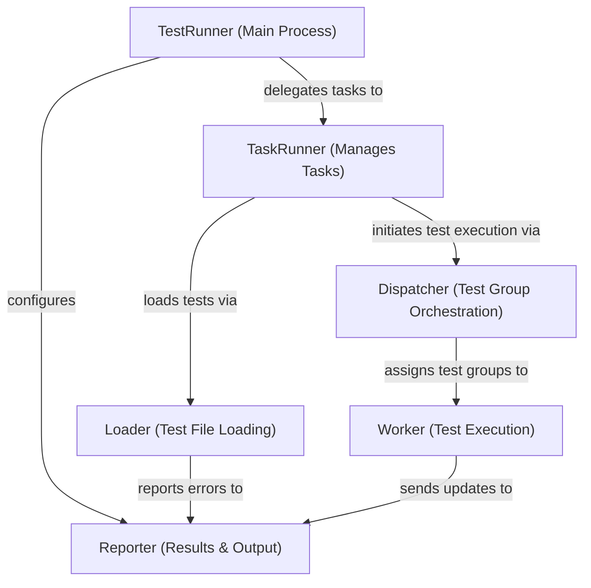
```mermaid
flowchart TD
  TestRunner["TestRunner (Main Process)"]
  TaskRunner["TaskRunner (Manages Tasks)"]
  Reporter["Reporter (Results & Output)"]
  Loader["Loader (Test File Loading)"]
  Dispatcher["Dispatcher (Test Group Orchestration)"]
  Worker["Worker (Test Execution)"]
  TestRunner -->|"delegates tasks to"| TaskRunner
  TestRunner -->|"configures"| Reporter
  TaskRunner -->|"loads tests via"| Loader
  TaskRunner -->|"initiates test execution via"| Dispatcher
  Loader -->|"reports errors to"| Reporter
  Dispatcher -->|"assigns test groups to"| Worker
  Worker -->|"sends updates to"| Reporter
```

The Playwright Test runner orchestrates the execution of tests from initial configuration loading to the final reporting of results. This process involves managing test configurations, loading test files, organizing tests for parallel execution, and coordinating activities across multiple processes.
Test execution begins with the TestRunner class in packages/playwright/src/runner/testRunner.ts, which loads Playwright's configuration and applies any command-line overrides. It then sets up a TestRun object, which encapsulates the entire state of a test execution, including configuration, options, and reporters, as outlined in packages/playwright/src/runner/tasks.ts. The TestRunner utilizes a queue to ensure that test runs and test listings are executed sequentially, preventing race conditions.
Test file loading is managed by dedicated loader processes, enhancing robustness by separating these potentially heavy operations from the main runner. The InProcessLoaderHost and OutOfProcessLoaderHost classes in packages/playwright/src/runner/loaderHost.ts abstract this process, with the latter using a child process to load test files. This approach allows for isolated configuration deserialization, test suite loading, and compilation cache management, as detailed in packages/playwright/src/loader/loaderMain.ts. Once loaded, tests are collected and filtered based on project configuration, command-line arguments, and sharding settings, resulting in a structured test suite hierarchy, which is handled by packages/playwright/src/runner/loadUtils.ts.
Test execution itself is broken down into a series of Task objects, managed by the TaskRunner in packages/playwright/src/runner/taskRunner.ts. Each Task can have a setup and teardown phase, and the TaskRunner handles error collection, global timeouts, and interruption signals. This task-based approach orchestrates various phases of the test lifecycle, from initial setup tasks like clearing output directories and plugin setup to the execution of global setup files, as described in packages/playwright/src/runner/tasks.ts.
For parallel execution, tests are organized into TestGroup units by packages/playwright/src/runner/testGroups.ts. These groups are collections of test cases designed to run together on a single worker, taking into account factors like project ID, worker hash, and serial suite constraints. The createTestGroups function ensures that tests are grouped appropriately for efficient parallel execution. The Dispatcher class in packages/playwright/src/runner/dispatcher.ts then orchestrates the execution of these test groups across multiple worker processes. It manages job distribution, worker lifecycle, and test result aggregation, including handling retries and reporting test events.
Interaction between the main process and worker processes is facilitated by the ProcessHost class in packages/playwright/src/runner/processHost.ts. This class provides mechanisms for inter-process communication (IPC), allowing the main runner to send messages to child processes (workers) and receive responses. It also manages the lifecycle of these child processes, including starting, stopping, and handling their exits. The WorkerHost class in packages/playwright/src/runner/workerHost.ts extends ProcessHost to specifically manage individual worker processes, setting up artifacts directories and handling worker-specific communication.
The TestRun object in packages/playwright/src/runner/tasks.ts divides test execution into independent Phase objects. Each phase contains a Dispatcher and a list of projects with their associated test groups. Projects are grouped into phases based on their dependencies to ensure correct execution order. This allows Playwright to manage test execution across different projects and their dependencies, supporting complex testing scenarios.
Error reporting and state persistence are integral to the test runner. The LastRunReporter in packages/playwright/src/runner/lastRun.ts tracks failed tests and persists this information in a .last-run.json file. This allows subsequent test runs to quickly re-execute only previously failed tests. The overall reporting system, detailed in Playwright Test Reporting System, handles various built-in and custom reporters to provide feedback on test execution.
Global timeouts are managed by the TimeoutWatcher within the TaskRunner, ensuring that test runs adhere to specified time limits. Additionally, the SigIntWatcher in packages/playwright/src/runner/sigIntWatcher.ts monitors for SIGINT signals (e.g., Ctrl+C) to gracefully handle interruptions, addressing issues like duplicate signals from package managers.


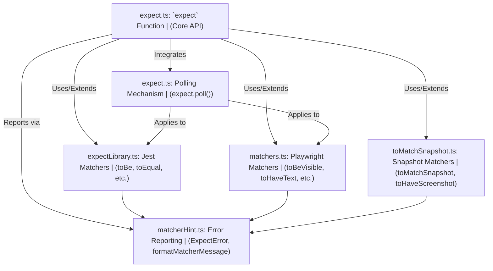
```mermaid
flowchart TD
  expect_ts_expect_Function["expect.ts: `expect` Function | (Core API)"]
  expectLibrary_ts_Jest_Matchers["expectLibrary.ts: Jest Matchers | (toBe, toEqual, etc.)"]
  matchers_ts_Playwright_Matchers["matchers.ts: Playwright Matchers | (toBeVisible, toHaveText, etc.)"]
  toMatchSnapshot_ts_Snapshot_Matchers["toMatchSnapshot.ts: Snapshot Matchers | (toMatchSnapshot, toHaveScreenshot)"]
  expect_ts_Polling_Mechanism["expect.ts: Polling Mechanism | (expect.poll())"]
  matcherHint_ts_Error_Reporting["matcherHint.ts: Error Reporting | (ExpectError, formatMatcherMessage)"]
  expect_ts_expect_Function -->|"Uses/Extends"| expectLibrary_ts_Jest_Matchers
  expect_ts_expect_Function -->|"Uses/Extends"| matchers_ts_Playwright_Matchers
  expect_ts_expect_Function -->|"Uses/Extends"| toMatchSnapshot_ts_Snapshot_Matchers
  expect_ts_expect_Function -->|"Integrates"| expect_ts_Polling_Mechanism
  expect_ts_expect_Function -->|"Reports via"| matcherHint_ts_Error_Reporting
  expectLibrary_ts_Jest_Matchers --> matcherHint_ts_Error_Reporting
  matchers_ts_Playwright_Matchers --> matcherHint_ts_Error_Reporting
  toMatchSnapshot_ts_Snapshot_Matchers --> matcherHint_ts_Error_Reporting
  expect_ts_Polling_Mechanism -->|"Applies to"| expectLibrary_ts_Jest_Matchers
  expect_ts_Polling_Mechanism -->|"Applies to"| matchers_ts_Playwright_Matchers
```

Playwright's expect assertion library extends the familiar Jest expect API to provide capabilities for asynchronous web interactions, visual regression, and snapshot testing. This library integrates with Playwright's browser automation, offering specific matchers that often poll for conditions to be met within a timeout, which is crucial for testing dynamic web applications.
The core of the assertion system is defined in packages/playwright/src/matchers/expect.ts. This file provides the central expect function, which serves as the entry point for creating assertions. It includes a suite of Playwright-specific matchers such as toBeAttached, toBeVisible, and toHaveScreenshot, designed for direct interaction with web elements. The library supports configuring assertion behavior, creating soft assertions that allow test execution to continue on failure, and enabling polling assertions (poll) that retry a check until it passes or a timeout is reached. Custom matchers can also be integrated through an extend mechanism.
The library offers a comprehensive set of Jest-like assertion matchers for general value comparisons, truthiness checks, numeric comparisons, and collection/string content validations. These are implemented in packages/playwright/src/matchers/expectLibrary.ts. This file also defines asymmetric matchers like any, arrayContaining, and objectContaining, which allow for flexible pattern matching within assertions. For robust error handling, the system generates descriptive error messages that include details like diffs, type information, and suggestions for alternative matchers.
Playwright's expect matchers are tailored for Locator, Page, Frame, and APIResponse objects, abstracting common assertions. For instance, toBeAttached and toBeChecked are locator-based matchers that assert the state or visibility of an element. toHaveURL asserts the URL of a Page, supporting various matching patterns including strings, regular expressions, and predicate functions. These matchers often rely on an internal _expect method, delegating assertion logic to the browser context for efficient DOM interaction and polling. This design, primarily driven by packages/playwright/src/matchers/matchers.ts, supports a client-server architecture where browser-side operations are reported back to the Node.js environment.
Snapshot testing is another key feature, with toMatchSnapshot for generic data comparison and toHaveScreenshot for visual regression. These functionalities, implemented in packages/playwright/src/matchers/toMatchSnapshot.ts, allow developers to compare data or visual output against stored baseline snapshots. The system handles automatic creation or update of snapshots based on configuration, providing detailed difference reporting in case of mismatches. Similarly, toMatchAriaSnapshot in packages/playwright/src/matchers/toMatchAriaSnapshot.ts specifically asserts the accessibility tree of a UI element or page, which is critical for ensuring accessibility compliance.
Detailed error reporting is a significant aspect of the expect library. The ExpectError class in packages/playwright/src/matchers/matcherHint.ts extends the native Error class to provide custom messages with detailed matcher results and formatted stack traces. Functions like formatMatcherMessage construct comprehensive error messages, incorporating assertion details, timeouts, and logging information, which aids in debugging test failures.


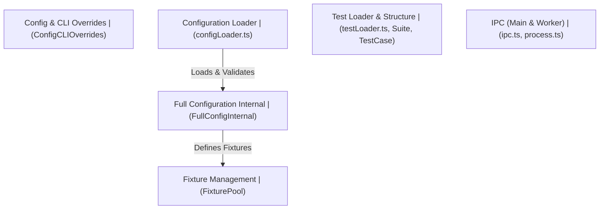
```mermaid
flowchart TD
  Config_CLI_Overrides["Config & CLI Overrides | (ConfigCLIOverrides)"]
  Configuration_Loader["Configuration Loader | (configLoader.ts)"]
  Full_Configuration_Internal["Full Configuration Internal | (FullConfigInternal)"]
  Test_Loader_Structure["Test Loader & Structure | (testLoader.ts, Suite, TestCase)"]
  Fixture_Management["Fixture Management | (FixturePool)"]
  IPC_Main_Worker["IPC (Main & Worker) | (ipc.ts, process.ts)"]
  Configuration_Loader -->|"Loads & Validates"| Full_Configuration_Internal
  Full_Configuration_Internal -->|"Defines Fixtures"| Fixture_Management
```

Playwright Test utilizes a comprehensive system for managing configurations, defining test structures, and facilitating inter-process communication. This system ensures consistent test execution and efficient resource management across various environments.
Test configurations are loaded, parsed, and validated through a dedicated loader component. The loadConfig function in packages/playwright/src/common/configLoader.ts is central to this process. It handles both CommonJS and ESM modules, dynamically importing user-defined configurations, and then applies command-line interface (CLI) overrides. These raw configurations are transformed into an internal, normalized structure, represented by FullConfigInternal and FullProjectInternal in packages/playwright/src/common/config.ts. Validation against predefined schemas ensures type and value correctness, with detailed error reporting for invalid settings. The defineConfig utility provides a mechanism for users to merge and extend configurations.
The framework structures tests hierarchically using Suite and TestCase objects defined in packages/playwright/src/common/test.ts. A Suite can represent a test file, a describe block, or a project, containing nested Suites or TestCases. TestCase instances encapsulate individual test executions, tracking their results and metadata. During the loading phase, the loadTestFile function in packages/playwright/src/common/testLoader.ts executes test files to discover these Suite and TestCase objects, populating a structured test tree. Utilities in packages/playwright/src/common/suiteUtils.ts assist in filtering this test tree based on various criteria, such as _only flags or command-line arguments, to control test execution scope.
Fixture management is a key aspect of Playwright Test, enabling reusable setup and teardown logic. The FixturePool class, defined in packages/playwright/src/common/fixtures.ts, registers, validates, and resolves fixture dependencies. Fixtures can have different scopes (e.g., test or worker), influencing their lifecycle. The PoolBuilder in packages/playwright/src/common/poolBuilder.ts constructs these FixturePool objects, chaining them to manage fixture resolution based on test types, project configurations, and suite structures.
Inter-process communication (IPC) is fundamental to Playwright Test's distributed execution model, where tests often run in separate worker processes. The IPC layer, detailed in packages/playwright/src/common/ipc.ts and packages/playwright/src/common/process.ts, defines strongly typed messages for exchanging configuration data, test events, and output between the main runner process and worker processes. ProcessRunner provides a base for worker processes, handling initialization, method dispatch, and termination, while also tracking environment variable changes.
Playwright Test integrates support for ECMAScript Modules (ESM) and TypeScript, allowing test files to be written using modern JavaScript features. The ESM loader host, configured by esmLoaderHost.ts in packages/playwright/src/common/esmLoaderHost.ts, handles on-the-fly transpilation of TypeScript files. This loader communicates with the main process to manage a compilation cache and track file dependencies. The validateTestDetails function in packages/playwright/src/common/validators.ts further ensures data consistency by normalizing test tags and annotations against a defined JSON schema.
Overall, these components collectively provide a robust foundation for defining, configuring, and executing tests within the Playwright framework, supporting various testing needs and development workflows.


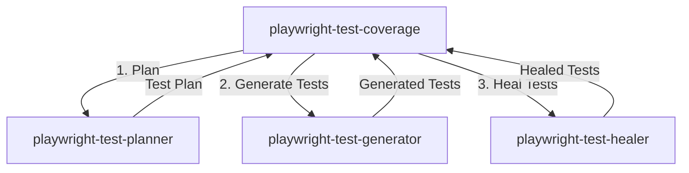
```mermaid
flowchart TD
  Test_Coverage["playwright-test-coverage"]
  Test_Planner["playwright-test-planner"]
  Test_Generator["playwright-test-generator"]
  Test_Healer["playwright-test-healer"]
  Test_Coverage -->|"1. Plan"| Test_Planner
  Test_Coverage -->|"2. Generate Tests"| Test_Generator
  Test_Coverage -->|"3. Heal Tests"| Test_Healer
  Test_Planner -->|"Test Plan"| Test_Coverage
  Test_Generator -->|"Generated Tests"| Test_Coverage
  Test_Healer -->|"Healed Tests"| Test_Coverage
```

Playwright integrates with AI agents to automate the generation, planning, and healing of tests. This system parses agent definitions, generates configurations for various AI platforms, and orchestrates subagents to manage the test automation lifecycle.
The core of this integration is the AgentSpec format, a common abstraction for defining AI agents. The AgentSpec encapsulates an agent's name, description, instructions, examples, and tools. This specification is parsed from markdown files, allowing for a consistent definition regardless of the target AI platform, as described in AgentSpec definitions are parsed by packages/playwright/src/agents/agentParser.ts.
Once an AgentSpec is defined, configurations are generated for different AI coding platforms, such as Claude, Opencode, Copilot, and VSCode. Each platform has a dedicated generator that translates the generic AgentSpec into the platform-specific format required for agent definition and tool mapping. For example, ClaudeGenerator prepares agent definitions for Claude, while VSCodeGenerator configures chatmode definitions for VS Code, using platform-specific tool mappings. This generation process is handled by packages/playwright/src/agents/generateAgents.ts, which also manages repository initialization and file system operations for these agents.
The system orchestrates specialized subagents to perform different stages of test automation:

The #playwright-test-planner subagent, defined in packages/playwright/src/agents/playwright-test-planner.agent.md, is responsible for creating comprehensive test plans. It uses browser interaction tools to navigate, explore web interfaces, analyze user flows, and design detailed test scenarios, outputting a markdown-formatted test plan. An example of its use is shown in the prompt template packages/playwright/src/agents/playwright-test-plan.prompt.md.
The #playwright-test-generator subagent, described in packages/playwright/src/agents/playwright-test-generator.agent.md, generates automated browser tests. It executes browser actions based on test steps, then translates these actions into Playwright test code. The agent utilizes a suite of playwright-test tools for simulating user interactions and verifying application behavior. Prompts such as packages/playwright/src/agents/playwright-test-generate.prompt.md guide this agent in generating tests for specific scenarios.
The #playwright-test-healer subagent, detailed in packages/playwright/src/agents/playwright-test-healer.agent.md, debugs and fixes failing Playwright tests. It employs a systematic workflow that includes running tests, interactively debugging failures, investigating errors using browser inspection tools (e.g., console messages, network requests, snapshots), and remediating test code. The packages/playwright/src/agents/playwright-test-heal.prompt.md provides an instruction to initiate the healing process.

These subagents are orchestrated by a high-level agent, such as the one defined in packages/playwright/src/agents/playwright-test-coverage.prompt.md, which chains calls to the planner, generator, and healer to achieve comprehensive test coverage generation. This sequential process ensures that tests are planned, created, and then automatically fixed if they fail, providing an intelligent approach to test automation.


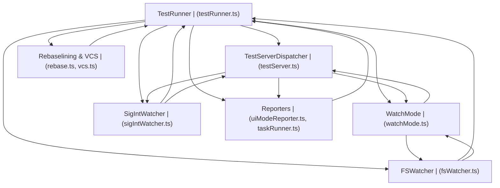
```mermaid
flowchart TD
  TestRunner["TestRunner | (testRunner.ts)"]
  TestServerDispatcher["TestServerDispatcher | (testServer.ts)"]
  WatchMode["WatchMode | (watchMode.ts)"]
  FSWatcher["FSWatcher | (fsWatcher.ts)"]
  SigIntWatcher["SigIntWatcher | (sigIntWatcher.ts)"]
  Rebaselining_VCS["Rebaselining & VCS | (rebase.ts, vcs.ts)"]
  Reporters["Reporters | (uiModeReporter.ts, taskRunner.ts)"]
  TestRunner --> TestServerDispatcher
  TestRunner --> WatchMode
  TestRunner --> FSWatcher
  TestRunner --> SigIntWatcher
  TestRunner --> Rebaselining_VCS
  TestRunner --> Reporters
  TestServerDispatcher --> WatchMode
  TestServerDispatcher --> SigIntWatcher
  TestServerDispatcher --> Reporters
  WatchMode --> TestServerDispatcher
  WatchMode --> FSWatcher
  FSWatcher --> TestRunner
  FSWatcher --> WatchMode
  SigIntWatcher --> TestRunner
  SigIntWatcher --> TestServerDispatcher
  Rebaselining_VCS --> TestRunner
  Reporters --> TestRunner
```

The Playwright test runner includes advanced features that extend beyond basic test execution, providing capabilities for interactive development, debugging, and continuous testing workflows. These features are orchestrated by the TestRunner class in packages/playwright/src/runner/testRunner.ts.
One such feature is an interactive watch mode, which allows developers to continuously run tests as files change. This mode is managed by the runWatchModeLoop function in packages/playwright/src/runner/watchMode.ts, leveraging an FSWatcher in packages/playwright/src/runner/fsWatcher.ts to monitor file system changes in test directories and their dependencies. The FSWatcher debounces events to prevent excessive notifications and supports dynamic updates to watched paths. In watch mode, users can interact with the test runner via a command-line interface to filter and re-run tests based on various criteria, such as changed files, project names, or specific test failures.
For UI-based interactions and remote execution, Playwright provides a Test Server, defined in packages/playwright/src/runner/testServer.ts. This server exposes Playwright's test runner functionalities via an HTTP/WebSocket interface. The TestServerDispatcher acts as a central hub, dispatching requests from connected clients to the underlying TestRunner. It intercepts standard output and error streams to redirect them to clients, enabling real-time display of test progress and logs in a UI. The UIModeReporter in packages/playwright/src/runner/uiModeReporter.ts is specifically designed for this UI context, optimizing communication by omitting raw buffer data.
Snapshot rebaselining is another sophisticated feature, managed in packages/playwright/src/runner/rebase.ts. This functionality handles updating expected snapshot files in test suites. When a snapshot test fails, addSuggestedRebaseline records the proposed changes. The applySuggestedRebaselines function then orchestrates the application of these updates, either by overwriting the original source files, generating a Git-compatible patch, or applying changes with conflict markers, depending on the configured update method. This process involves parsing the Abstract Syntax Tree (AST) of source files to precisely identify and update snapshot assertion arguments.
Version control integration enhances testing workflows by detecting changed test files. The detectChangedTestFiles function in packages/playwright/src/runner/vcs.ts uses Git commands to identify untracked or modified files relative to a baseCommit, which can then be used to filter tests for execution, allowing developers to focus on tests relevant to recent code changes.
Finally, the test runner includes robust handling for SIGINT signals (e.g., Ctrl+C). The SigIntWatcher and FixedNodeSIGINTHandler classes in packages/playwright/src/runner/sigIntWatcher.ts provide a mechanism to observe these signals and manage their handling, specifically addressing issues with duplicate signals that can occur from tools like npm. This ensures that the test runner can gracefully shut down upon interruption, preventing premature termination while allowing registered handlers to perform necessary cleanup operations. The TaskRunner in packages/playwright/src/runner/taskRunner.ts integrates SigIntWatcher to halt test execution when a SIGINT is received, ensuring a controlled exit. For more on the core mechanisms of test execution, refer to Test Runner Execution Lifecycle.


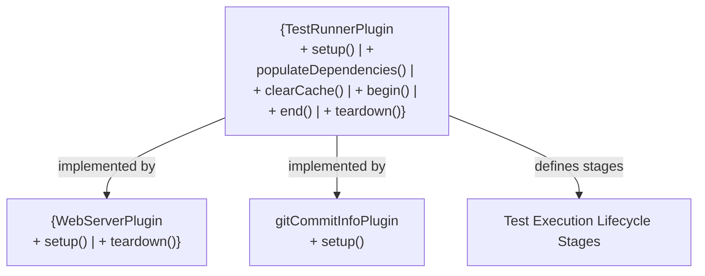
```mermaid
flowchart TD
  TestRunnerPlugin["{TestRunnerPlugin<br/> + setup() | + populateDependencies() | + clearCache() | + begin() | + end() | + teardown()}"]
  WebServerPlugin["{WebServerPlugin<br/> + setup() | + teardown()}"]
  GitCommitInfoPlugin["gitCommitInfoPlugin<br/> + setup()"]
  TestExecutionLifecycle["Test Execution Lifecycle Stages"]
  TestRunnerPlugin -->|"implemented by"| WebServerPlugin
  TestRunnerPlugin -->|"implemented by"| GitCommitInfoPlugin
  TestRunnerPlugin -->|"defines stages"| TestExecutionLifecycle
```

Playwright's test runner incorporates a modular plugin system designed to extend and customize the test execution lifecycle. This system allows for the integration of external functionalities, such as managing web servers and collecting environmental metadata, by providing a structured interface for plugins to hook into various stages of the test run.
The core of this system is defined by the TestRunnerPlugin interface, located in packages/playwright/src/plugins/index.ts. This interface outlines a set of optional methods, including setup, teardown, populateDependencies, clearCache, begin, and end. These methods correspond to specific points in the test lifecycle, enabling plugins to perform actions at startup, during dependency resolution, at the beginning or end of test suites, and during final cleanup. Plugins are registered either as direct instances of TestRunnerPlugin or through factory functions that produce plugin instances, offering flexibility in their instantiation.
A key application of this plugin architecture is the WebServerPlugin, implemented in packages/playwright/src/plugins/webServerPlugin.ts. This plugin automates the management of web servers required for testing. It can launch a server process, monitor its availability (e.g., by checking a URL or port), and gracefully shut it down upon test completion. The WebServerPlugin ensures that necessary backend services are running before tests commence and are properly terminated afterward, managing aspects such as process execution, standard I/O monitoring, and availability checks with configurable timeouts.
Another example of a TestRunnerPlugin is the gitCommitInfoPlugin, found in packages/playwright/src/plugins/gitCommitInfoPlugin.ts. This plugin enriches test run metadata by capturing relevant Git commit information and details about the Continuous Integration (CI) environment. It automatically detects the CI provider, extracts commit hashes, branch names, and build URLs, and gathers comprehensive Git commit details, including diffs. This metadata is then attached to the test configuration, providing valuable context for traceability, debugging, and reporting test results. The collection of this information is conditional, occurring only if explicitly configured or if the test run is detected within a CI environment, minimizing overhead when not required.
Together, these plugins illustrate how the modular design allows for the seamless integration of diverse functionalities into the Playwright test runner, enhancing its capabilities for automated browser testing.


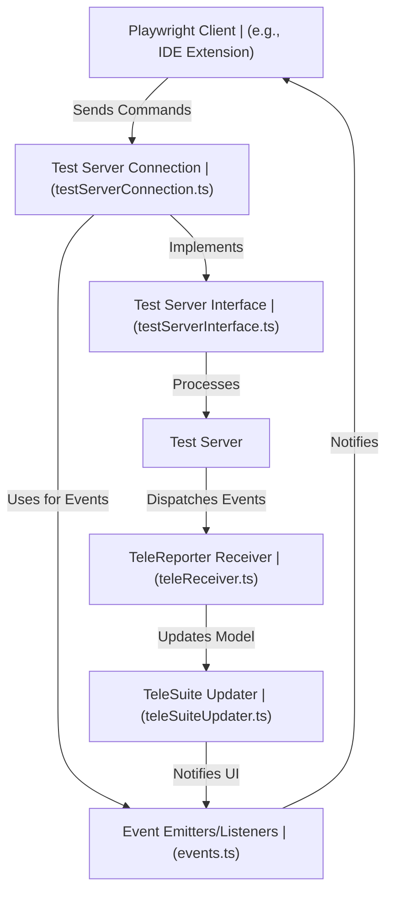
```mermaid
flowchart TD
  Playwright_Client_e_g_IDE_Extension["Playwright Client | (e.g., IDE Extension)"]
  Test_Server_Connection["Test Server Connection | (testServerConnection.ts)"]
  Test_Server_Interface["Test Server Interface | (testServerInterface.ts)"]
  Event_Emitters_Listeners["Event Emitters/Listeners | (events.ts)"]
  Test_Server["Test Server"]
  TeleReporter_Receiver["TeleReporter Receiver | (teleReceiver.ts)"]
  TeleSuite_Updater["TeleSuite Updater | (teleSuiteUpdater.ts)"]
  Playwright_Client_e_g_IDE_Extension -->|"Sends Commands"| Test_Server_Connection
  Test_Server_Connection -->|"Implements"| Test_Server_Interface
  Test_Server_Connection -->|"Uses for Events"| Event_Emitters_Listeners
  Test_Server_Interface -->|"Processes"| Test_Server
  Test_Server -->|"Dispatches Events"| TeleReporter_Receiver
  TeleReporter_Receiver -->|"Updates Model"| TeleSuite_Updater
  Event_Emitters_Listeners -->|"Notifies"| Playwright_Client_e_g_IDE_Extension
  TeleSuite_Updater -->|"Notifies UI"| Event_Emitters_Listeners
```

Playwright's architecture includes a set of isomorphic utilities, defined in packages/playwright/src/isomorphic, designed to operate consistently across different environments, particularly for its test runner and interactions with a dedicated test server. These utilities are crucial for managing event-driven communication, generating unique identifiers for artifacts, and processing test results.
Central to this is the event management system provided by packages/playwright/src/isomorphic/events.ts. This module offers a basic event emitter mechanism using a Disposable pattern, allowing for decoupled event handling and resource cleanup. This system enables components to subscribe to and publish events without direct dependencies, facilitating modularity and maintainability.
For parallel test execution and artifact management, Playwright employs a method to generate unique folder names for artifacts. The artifactsFolderName function in packages/playwright/src/isomorphic/folders.ts takes a worker index and creates a distinct folder name, ensuring that artifacts from different worker processes do not collide.
A significant aspect of the isomorphic utilities is the client-side implementation for connecting to and interacting with a test server. The interfaces defined in packages/playwright/src/isomorphic/testServerInterface.ts specify the contract for commands and events exchanged between a client (e.g., an IDE extension) and the Playwright test server. This includes methods for initialization, test execution, browser management, and various reporting functionalities. The actual client-side connection logic is implemented in packages/playwright/src/isomorphic/testServerConnection.ts, which handles message sending, event dispatching, and managing the connection state over a transport layer, such as WebSockets. This allows external tools to programmatically control and monitor Playwright test runs.
To process and present test results, Playwright includes a deserialization mechanism for test reporter events. The TeleReporterReceiver class in packages/playwright/src/isomorphic/teleReceiver.ts reconstructs test results from JSON messages received from the test server. It dispatches these deserialized events to a ReporterV2 instance, enabling remote or out-of-process reporting. Building upon this, the TeleSuiteUpdater in packages/playwright/src/isomorphic/teleSuiteUpdater.ts manages and updates a hierarchical test suite (TeleSuite) model using these events, tracking test progress, configuration, and errors. This provides a consolidated, dynamic view of the test run's progress, particularly useful for user interfaces.
Finally, the TestTree class in packages/playwright/src/isomorphic/testTree.ts organizes this processed test data into a hierarchical tree structure of test items (suites, files, test cases, individual tests). This structure is primarily used for displaying and filtering test results in user interfaces, offering a clear visual representation of the test run's outcomes. Furthermore, to optimize memory usage, especially with large data structures containing many duplicate strings, Playwright utilizes a string interning pool, as defined in packages/playwright/src/isomorphic/stringInternPool.ts. This mechanism ensures that only one copy of each unique string value is stored, reducing memory footprint. The types.d.ts file in this directory also provides TypeScript definitions for GitCommitInfo, CIInfo, and MetadataWithCommitInfo, standardizing data exchange related to code changes and continuous integration.


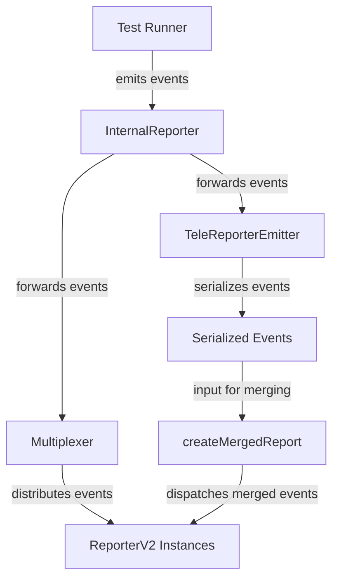
```mermaid
flowchart TD
  Test_Runner["Test Runner"]
  InternalReporter["InternalReporter"]
  Multiplexer["Multiplexer"]
  TeleReporterEmitter["TeleReporterEmitter"]
  ReporterV2_Instances["ReporterV2 Instances"]
  Serialized_Events["Serialized Events"]
  createMergedReport["createMergedReport"]
  Test_Runner -->|"emits events"| InternalReporter
  InternalReporter -->|"forwards events"| Multiplexer
  InternalReporter -->|"forwards events"| TeleReporterEmitter
  Multiplexer -->|"distributes events"| ReporterV2_Instances
  TeleReporterEmitter -->|"serializes events"| Serialized_Events
  Serialized_Events -->|"input for merging"| createMergedReport
  createMergedReport -->|"dispatches merged events"| ReporterV2_Instances
```

Playwright's reporting system provides mechanisms for communicating test execution status and results across various formats. The core components are located within the packages/playwright/src/reporters directory.
A foundational element is the TerminalReporter defined in packages/playwright/src/reporters/base.ts. This base class manages terminal output, including colorization, error formatting, and summary generation. It processes test lifecycle events, formats test titles and error messages, and generates overall test summaries and slow test reports. It also handles attachments, such as visual regression differences, for clearer presentation in failure reports.
To accommodate diverse reporting needs, Playwright employs a Multiplexer system, implemented in packages/playwright/src/reporters/multiplexer.ts. This class acts as a composite reporter that forwards all test runner events to a collection of ReporterV2 instances. This design enables multiple reporters—such as console, JSON, or HTML reporters—to process the same events concurrently, enhancing flexibility without requiring the test runner to interact with each one individually. The Multiplexer also includes error handling to prevent a single reporter's failure from disrupting the entire test run. The ReporterV2 interface, defined in packages/playwright/src/reporters/reporterV2.ts, standardizes how reporters interact with test events and includes a wrapper to ensure compatibility with older reporter versions.
The InternalReporter, located in packages/playwright/src/reporters/internalReporter.ts, serves as a central hub for Playwright test reporting. It utilizes the Multiplexer to dispatch events and enriches error objects with code snippets using addLocationAndSnippetToError. This function enhances debugging by providing a highlighted code frame around the error's location in the source file, which is then added to the error's snippet property for consistent display across all configured reporters.
Playwright includes several built-in reporters:

Dot Reporter: In packages/playwright/src/reporters/dot.ts, this reporter provides a compact, character-based representation of test progress in the terminal, printing single characters for different test outcomes and detailed error information on failure.
Empty Reporter: The packages/playwright/src/reporters/empty.ts file defines a no-operation reporter, useful when no output is desired.
GitHub Reporter: Located in packages/playwright/src/reporters/github.ts, this reporter generates annotations compatible with GitHub Actions, displaying warnings, errors, and notices directly within pull requests and workflow logs.
HTML Reporter: The HtmlReporter in packages/playwright/src/reporters/html.ts generates a comprehensive, self-contained HTML report. It aggregates results from potentially sharded runs, processes attachments, creates code snippets, and can automatically open the report in a browser. All data is embedded into a single index.html file, making it portable.
JSON Reporter: Defined in packages/playwright/src/reporters/json.ts, this reporter produces a structured JSON summary of test run outcomes, including configuration, suite structures, test results, and errors. It merges test suites from different projects that correspond to the same file and location for consolidated reporting.
JUnit Reporter: In packages/playwright/src/reporters/junit.ts, this reporter generates test results in JUnit XML format, supporting configuration via environment variables for aspects like ANSI stripping and including project names.
Line Reporter: The packages/playwright/src/reporters/line.ts file provides a line-by-line progress update in TTY environments, updating the current test status in place using ANSI escape codes for dynamic display.
List Reporter: Located in packages/playwright/src/reporters/list.ts, this reporter offers a real-time, interactive list-style reporting in the terminal, updating test statuses and steps in place.
List Mode Reporter: The packages/playwright/src/reporters/listModeReporter.ts is specifically designed for listing discovered tests without execution, outputting a formatted list of all tests, including their location and project information.

For distributed testing environments, Playwright includes mechanisms for serializing and merging blob reports. The TeleReporterEmitter, defined in packages/playwright/src/reporters/teleEmitter.ts, serializes test runner events into JSON objects suitable for transmission, converting absolute paths to relative paths and encoding binary data. The createMergedReport function in packages/playwright/src/reporters/merge.ts combines multiple blob reports (ZIP files containing JSONL events) into a single, unified report. This process involves extracting and parsing events, applying patchers to ensure data consistency, uniqueness (e.g., IdsPatcher for test IDs, AttachmentPathPatcher for attachment paths), and harmonizing path separators (PathSeparatorPatcher). The packages/playwright/src/reporters/versions/blobV1.ts file defines the data structures for this blob format, crucial for the TeleReporterEmitter and report merging functionality.


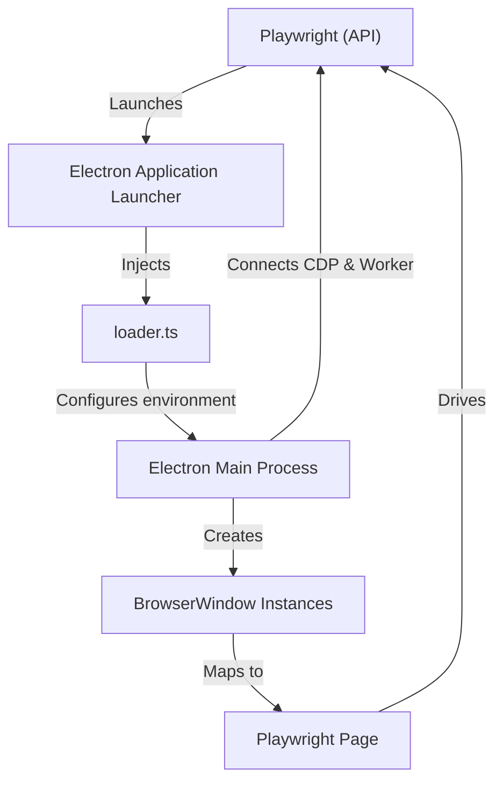
```mermaid
flowchart TD
  Playwright["Playwright (API)"]
  ElectronAppLauncher["Electron Application Launcher"]
  LoaderScript["loader.ts"]
  ElectronMainProcess["Electron Main Process"]
  BrowserWindowInstance["BrowserWindow Instances"]
  PlaywrightPage["Playwright Page"]
  Playwright -->|"Launches"| ElectronAppLauncher
  ElectronAppLauncher -->|"Injects"| LoaderScript
  LoaderScript -->|"Configures environment"| ElectronMainProcess
  ElectronMainProcess -->|"Connects CDP & Worker"| Playwright
  ElectronMainProcess -->|"Creates"| BrowserWindowInstance
  BrowserWindowInstance -->|"Maps to"| PlaywrightPage
  PlaywrightPage -->|"Drives"| Playwright
```

Playwright integrates with Electron applications, enabling automation and testing by treating Electron's BrowserWindow objects as Playwright Page objects. This allows for full API access within the Electron environment, including evaluation of JavaScript code directly within the Electron main process.
The core functionality for launching and controlling Electron applications resides within the packages/playwright-electron directory. The primary entry point is the electron module, which exposes methods to launch an Electron application and interact with its various components. This module manages the connection to both the Node.js debugger and the Chromium DevTools of the Electron process, which is essential for comprehensive control.
After an Electron application is launched, it is represented by an ElectronApplication instance. This instance provides access to the application's windows as Playwright Page objects, allowing standard Playwright API commands (e.g., clicking elements, filling forms) to be used. It also enables evaluation of JavaScript within the Electron main process, facilitating interaction with Electron-specific APIs and the application's backend logic. Furthermore, the ElectronApplication provides mechanisms to manage the application's lifecycle, access the underlying Node.js ChildProcess, and listen for application-level events.
A critical aspect of this integration is the loader.ts file, located at packages/playwright-electron/src/loader.ts. This file acts as an Electron main process loader.js and is responsible for preparing the Electron environment for Playwright. It applies Chromium command-line switches, exposes the Electron module globally for Playwright's bootstrapping, and, importantly, defers the Electron application's ready event. This deferral ensures that Playwright can establish its connections and set up auto-attachment mechanisms before the Electron app fully initializes, thereby coordinating the startup process between Playwright and the Electron application.
The design of the Playwright-Electron integration emphasizes consistency with the core Playwright API, encouraging the use of standard Playwright BrowserContext or Page APIs where applicable. This approach enables developers to leverage existing Playwright testing patterns and features, such as tracing and screencasting, within the Electron context. For functionalities not directly covered by Playwright's public APIs, the integration guides users towards utilizing native Electron APIs. The separation of Electron-specific API extensions into a dedicated @playwright/electron package aligns with Playwright's modular strategy for supporting different environments while maintaining a unified automation experience.


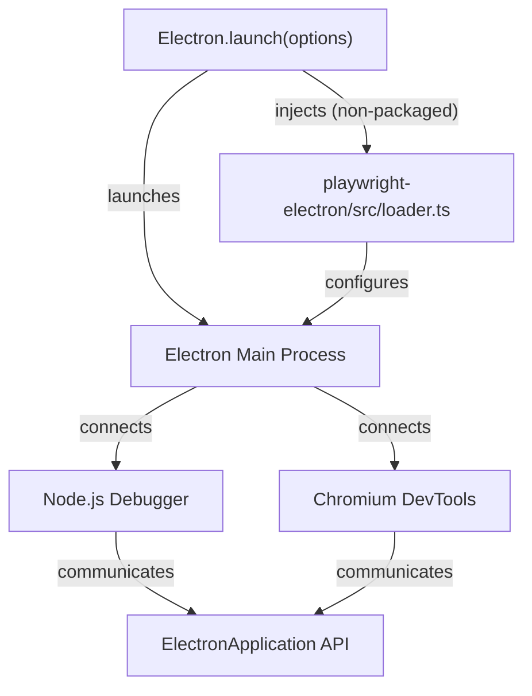
```mermaid
flowchart TD
  ElectronLaunch["Electron.launch(options)"]
  ElectronAppProcess["Electron Main Process"]
  PlaywrightLoader["playwright-electron/src/loader.ts"]
  NodeDebugger["Node.js Debugger"]
  ChromiumDevTools["Chromium DevTools"]
  ElectronApplicationAPI["ElectronApplication API"]
  ElectronLaunch -->|"launches"| ElectronAppProcess
  ElectronLaunch -->|"injects (non-packaged)"| PlaywrightLoader
  ElectronAppProcess -->|"connects"| NodeDebugger
  ElectronAppProcess -->|"connects"| ChromiumDevTools
  PlaywrightLoader -->|"configures"| ElectronAppProcess
  NodeDebugger -->|"communicates"| ElectronApplicationAPI
  ChromiumDevTools -->|"communicates"| ElectronApplicationAPI
```

Playwright provides a dedicated integration for launching and interacting with Electron applications. This allows users to automate Electron-based desktop applications using the familiar Playwright API. The core functionality is found within the Electron class, which offers a launch method to initiate an Electron application. This method accommodates various configuration options, including specifying the executablePath for the Electron binary, providing command-line args to the application, setting env variables, and controlling Chromium sandbox behavior with chromiumSandbox.
During the launch process, Playwright establishes connections to both the Node.js debugger and the Chromium DevTools of the Electron process. This dual connection is crucial for comprehensive automation, enabling interaction with both the renderer processes (via DevTools) and the main process (via the Node.js debugger). For non-packaged Electron applications, a custom loader located at packages/playwright-electron/src/loader.ts is injected. This loader plays a critical role in synchronizing the Electron application's readiness with the Playwright client, ensuring that Playwright can attach and begin automation early in the application's lifecycle. This coordination is achieved by deferring the Electron app.whenReady() event until signaled by Playwright.
Once an Electron application is launched, it is represented by an ElectronApplication object. This object provides methods to access and control the application's windows as Playwright Page objects, evaluate JavaScript within the Electron main process, and manage the application's lifecycle. For a more detailed understanding of the lifecycle management, refer to Electron Main Process Integration and Lifecycle Management.


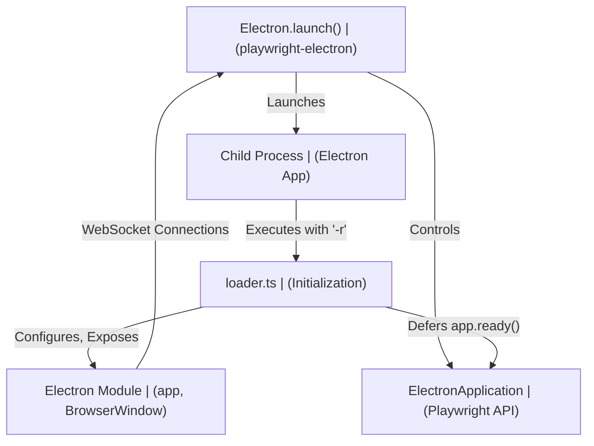
```mermaid
flowchart TD
  Electron_launch["Electron.launch() | (playwright-electron)"]
  childProcess["Child Process | (Electron App)"]
  ElectronApplication["ElectronApplication | (Playwright API)"]
  loader_ts["loader.ts | (Initialization)"]
  Electron_Module["Electron Module | (app, BrowserWindow)"]
  Electron_launch -->|"Launches"| childProcess
  Electron_launch -->|"Controls"| ElectronApplication
  childProcess -->|"Executes with '-r'"| loader_ts
  loader_ts -->|"Configures, Exposes"| Electron_Module
  loader_ts -->|"Defers app.ready()"| ElectronApplication
  Electron_Module -->|"WebSocket Connections"| Electron_launch
```

Playwright's integration with Electron applications involves specific mechanisms to manage the Electron main process, ensuring seamless automation and interaction. The core of this integration is handled by the loader.ts file, which orchestrates the Electron application's startup and exposes key modules for Playwright's use.
The packages/playwright-electron/src/loader.ts file functions as an Electron main process loader.js, performing several critical tasks before the application fully initializes. It begins by applying a predefined set of Chromium command-line switches to the Electron application. This configuration influences browser behavior for automation purposes, such as enabling or disabling specific features. Additionally, the loader.ts manipulates process.argv to prioritize user-defined arguments, addressing potential conflicts in argument parsing.
A key aspect of this integration is the exposure of the electronModule (the electron module) globally as __playwright_electron. This global variable serves as a bootstrap mechanism, allowing Playwright to access Electron's core functionalities, such as the app object, from its client-side environment.
To ensure proper synchronization between Playwright and the Electron application, the loader.ts intercepts and defers Electron's app.whenReady() event. This prevents the application from fully launching until explicitly signaled by Playwright. This deferral is crucial for Playwright to establish its auto-attach mechanisms and ensure that it can connect to the Electron process early in its lifecycle. A global function, __playwright_run, is exposed, and when called, it triggers the original whenReady() promise and re-emits the ready event, allowing the Electron application to resume its startup process. This coordinated approach, facilitated by __playwright_electron and __playwright_run, is essential for robust Playwright control over the Electron main process.
The ElectronApplication class, defined in packages/playwright-electron/src/electron.ts, represents a launched Electron application and provides high-level control over its lifecycle. It offers methods to evaluate JavaScript code directly within the Electron main process, allowing interaction with Electron APIs and custom logic. This includes the evaluate method for executing a function and returning its result, and evaluateHandle for returning a JSHandle to the result, enabling further manipulation. The ElectronApplication also provides access to the underlying Node.js childProcess.ChildProcess via its process property and allows for graceful termination of the Electron application through its close method.
Furthermore, the ElectronApplication allows for listening to various events from the Electron process, such as close, console, and window, providing insight into the application's lifecycle and behavior. It also facilitates mapping Electron BrowserWindow instances to Playwright Page objects, enabling standard Playwright automation commands on Electron windows. This tight integration ensures that Playwright can manage the Electron main process from launch to termination, providing comprehensive control and monitoring capabilities as described in Launching and Connecting to Electron Applications.
Playwright provides tools for visualizing test results and debugging automation scripts. This includes the generation of interactive HTML test reports, the Trace Viewer for analyzing test execution traces, and the Playwright Inspector for code generation, element inspection, assertion management, and interaction recording.
The HTML reporter, found in packages/html-reporter, generates interactive web-based reports from test results. It uses Vite for building a React-based user interface that processes and displays test data. The vite.config.ts in packages/html-reporter/vite.config.ts configures asset bundling, path aliases, and output for the report. The core of the reporter resides in packages/html-reporter/src, where index.tsx orchestrates the loading and rendering of report data. This involves decompressing base64 encoded zip archives of report data into a structured HTMLReport object, which is then rendered by components like ReportView for overall layout and navigation, TestFilesView for listing test files, and TestCaseView for detailed individual test results. Filtering capabilities are provided by the Filter class in packages/html-reporter/src/filter.ts. Styling is managed through a comprehensive design system defined in packages/html-reporter/src/colors.css and foundational styles in packages/html-reporter/src/common.css.
The Trace Viewer, located in packages/trace-viewer, is a web application for analyzing recorded Playwright traces. Its packages/trace-viewer/index.html file initializes the React UI and registers a service worker (sw.bundle.js). The Vite configuration in packages/trace-viewer/vite.config.ts handles the build process, including multiple HTML entry points and path aliases. A key component of the Trace Viewer is its service worker, defined in packages/trace-viewer/src/sw/main.ts and entered via packages/trace-viewer/src/sw-main.ts. This service worker intercepts network requests to serve trace data, snapshots, and resources directly from loaded trace files. It supports various TraceLoaderBackend implementations, such as ZipTraceLoaderBackend for .zip files and FetchTraceLoaderBackend for HTTP servers, as seen in packages/trace-viewer/src/sw/traceLoaderBackends.ts. The UI, housed in packages/trace-viewer/src/ui, provides specialized views for action lists, console logs, network activity, and snapshots. Utilities in packages/trace-viewer/src/third_party/devtools.ts enable the generation of curl commands and fetch API calls from recorded network data. The packages/trace-viewer/snapshot.html file is specifically designed to embed sandboxed iframes for displaying snapshots, leveraging the service worker for content delivery.
The Playwright Inspector, found in packages/recorder, provides a UI for recording user interactions, inspecting DOM elements, generating Playwright code, and managing assertions. The packages/recorder/index.html file serves as the entry point for this application, loading the main React-based UI from packages/recorder/src/index.tsx. The core logic in packages/recorder/src/recorder.tsx manages the recorder's state, communicates with a Playwright backend, and processes events to facilitate interaction recording. This includes defining types for actions and signals in packages/recorder/src/actions.d.ts and packages/recorder/src/recorderTypes.d.ts. The CallLogView component in packages/recorder/src/callLog.tsx is responsible for displaying recorded interactions. The Vite configuration in packages/recorder/vite.config.ts handles the build process, including React integration and module aliasing.


```mermaid
flowchart TD
  Vite_Build_Process["Vite Build Process"]
  bundle_ts_Plugin["bundle.ts (Plugin)"]
  index_html["index.html (Template)"]
  HTML_Report["Generated HTML Report"]
  Client_side_App["Client-side App (React)"]
  ZipReport["ZipReport (Decompression)"]
  Report_View["Report View (Interactive Display)"]
  Vite_Build_Process -->|"uses"| bundle_ts_Plugin
  Vite_Build_Process -->|"processes"| index_html
  bundle_ts_Plugin -->|"modifies"| index_html
  index_html -->|"results in"| HTML_Report
```

The HTML reporter generates interactive web-based reports for Playwright test results. This process involves the compression of test data into zip archives, which are then embedded within the HTML report itself. When the report is opened in a browser, a React application running client-side decompresses and parses this data for interactive display.
The report's foundational HTML structure is defined in packages/html-reporter/index.html. This file sets up the basic webpage and loads the main JavaScript application. The core logic for rendering and interacting with the report is located in packages/html-reporter/src. The main entry point, packages/html-reporter/src/index.tsx, orchestrates the loading and rendering process. It uses a ReportLoader component to manage the report loading, which in turn utilizes a ZipReport class to handle the decompression and parsing of the embedded base64 encoded zip archive containing the report data. This ensures the report is self-contained and avoids external data requests.
The client-side application is built using React, with styling defined through a comprehensive CSS design system, including support for light and dark modes, found in packages/html-reporter/src/colors.css and packages/html-reporter/src/common.css. Vite, configured via packages/html-reporter/vite.config.ts, is used for asset bundling and optimization during the build process. A custom Vite plugin, defined in packages/html-reporter/bundle.ts, processes the index.html to remove license comment blocks.
The interactive nature of the report is facilitated by various React components. These components enable functionalities such as filtering test results based on various criteria like project, status, text, labels, and annotations, as implemented by the Filter class in packages/html-reporter/src/filter.ts. Navigation and URL management are handled by components and hooks defined in packages/html-reporter/src/links.tsx, allowing users to link to specific test results or filter views. Components like HeaderView in packages/html-reporter/src/headerView.tsx provide global filtering capabilities and display test statistics. UI elements such as Chip and AutoChip in packages/html-reporter/src/chip.tsx organize content into collapsible sections, while Expandable in packages/html-reporter/src/expandable.tsx provides general collapsible content. These components are styled using their respective CSS files, such as packages/html-reporter/src/chip.css and packages/html-reporter/src/expandable.css. Icons for visual cues are provided by packages/html-reporter/src/icons.tsx and can be colored using the styles defined in packages/html-reporter/src/colors.css. Additionally, the report includes functionality for copying text to the clipboard, managed by CopyToClipboard and CopyToClipboardContainer components in packages/html-reporter/src/copyToClipboard.tsx and styled by packages/html-reporter/src/copyToClipboard.css.


```mermaid
flowchart TD
  Client_Browser["Client/Browser"]
  Service_Worker["Service Worker"]
  Trace_Loaders["TraceLoaders | (Zip, Fetch)"]
  SnapshotServer["SnapshotServer"]
  Loaded_Traces_Cache["Loaded Traces Cache"]
  External_Trace_URI["External Trace URI"]
  Client_Browser -->|"Fetch Requests"| Service_Worker
  Service_Worker -->|"Responds"| Client_Browser
  Service_Worker -->|"Loads Traces"| Trace_Loaders
  Service_Worker -->|"Serves Snapshots/Resources"| SnapshotServer
  Service_Worker -->|"Manages Cache"| Loaded_Traces_Cache
  Trace_Loaders -->|"Fetches Data"| External_Trace_URI
```

The Playwright Trace Viewer's service worker, primarily defined in packages/trace-viewer/src/sw/main.ts, plays a central role in efficiently handling and serving trace data. Its core function is to act as a local proxy, intercepting network requests and redirecting them to serve trace-related content directly from loaded trace files or cached resources. This mechanism ensures that the Trace Viewer can display complex trace information, including recorded page snapshots and associated network traffic, with high performance and reliability.
Upon activation, the service worker registers itself and immediately takes control of the client pages, ensuring that all subsequent network requests are routed through it. It manages the lifecycle of trace loading and caching, using loadTrace and innerLoadTrace to process trace files. A Map named loadedTraces caches TraceLoader and SnapshotServer instances to prevent redundant loading, while clientIdToTraceUrls tracks active clients, allowing for garbage collection of unused traces to free up resources.
The service worker intercepts various request paths, each serving a specific purpose:

Requests to /restartServiceWorker trigger a reset, clearing all loaded traces and client associations.
A /ping endpoint provides a health check for the service worker.
/snapshot/ is handled by a SnapshotServer instance dedicated to serving page and frame snapshots. This includes special handling for HTTPS deployments to enforce Content-Security-Policy and upgrade insecure requests.
Endpoints like /contexts, /snapshotInfo/, /closest-screenshot/, and /sha1/ retrieve trace metadata, snapshot information, the closest screenshot for a given time, and resources identified by their SHA1 hash, respectively.
The service worker also processes out-of-scope requests, potentially redirecting them to network resources while ensuring proper security headers for HTTPS deployments.

To support different trace file formats, the service worker leverages TraceLoaderBackend implementations, specifically ZipTraceLoaderBackend for .zip files and FetchTraceLoaderBackend for traces served from HTTP servers where each entry is individually addressable. These backends, defined in packages/trace-viewer/src/sw/traceLoaderBackends.ts, abstract the data fetching mechanism, allowing the TraceLoader to work seamlessly with various sources. Furthermore, progress reporting for trace loading is managed through splitProgress functions, defined in packages/trace-viewer/src/sw/progress.ts, which sends updates to the client via client.postMessage. This architecture enables the Playwright Trace Viewer to efficiently load, cache, and display rich trace data, providing a smooth user experience.


```mermaid
flowchart TD
  Workbench["Workbench | (workbench.tsx)"]
  Views["Specialized Views | (actionList.tsx, consoleTab.tsx, networkTab.tsx)"]
  TimelineVisuals["Timeline & Filmstrip | (timeline.tsx, filmStrip.tsx)"]
  Snapshot["Snapshot & Inspector | (snapshotTab.tsx, inspectorTab.tsx)"]
  BrowserFrameComponent["BrowserFrame | (browserFrame.tsx)"]
  Workbench -->|"manages & renders"| Views
  Workbench -->|"integrates"| TimelineVisuals
  Views -->|"interacts with"| Snapshot
  Snapshot -->|"displays within"| BrowserFrameComponent
  TimelineVisuals -->|"visualizes frames"| BrowserFrameComponent
```

The Trace Viewer's user interface, primarily built with React, provides interactive visualizations of trace data. The UI is designed to present various aspects of a test run, including actions, console output, network requests, and visual snapshots, in a cohesive and navigable manner. The main components are located within the packages/trace-viewer/src/ui directory.
Central to the UI is the ActionList component, defined in packages/trace-viewer/src/ui/actionList.tsx. This component renders an interactive, hierarchical list of actions captured during a trace. It allows users to filter actions, select specific events, and view details such as duration, status, and any associated attachments or console logs. A corresponding CSS file, packages/trace-viewer/src/ui/actionList.css, styles these action entries, controlling their layout, text handling, and visual indicators for errors or warnings.
For detailed information about individual actions, the CallTab component in packages/trace-viewer/src/ui/callTab.tsx displays comprehensive data, including the action's title, execution time, parameters, and return value. This component relies on utility functions like propertyToString and parseSerializedValue to convert raw trace data into a human-readable format. Its styling is managed by packages/trace-viewer/src/ui/callTab.css.
Console and standard I/O (stdio) entries are visualized by the ConsoleTab component, implemented in packages/trace-viewer/src/ui/consoleTab.tsx. This component processes trace events to display logs, warnings, and errors with timestamps, sources, and messages. It also aggregates identical messages to provide a replay count, improving readability for repetitive output. The useConsoleTabModel React hook is responsible for preparing this data from the TraceModel. Styling is provided by packages/trace-viewer/src/ui/consoleTab.css. The component also handles the conversion of ANSI-formatted text to HTML for colored terminal outputs using the formatAnsi function.
Network activity is presented through the NetworkTab component, which enables users to filter, sort, and inspect individual network requests made during the trace. This includes viewing headers, request/response bodies, and timing information. To facilitate debugging and reproduction, the Trace Viewer offers functionality to generate code snippets for page.request API calls. The packages/trace-viewer/src/ui/codegen.ts file contains classes like JSCodeGen, PythonCodeGen, CSharpCodeGen, and JavaCodeGen that transform HAR Request objects into ready-to-use Playwright code in various programming languages. These generators account for URL, method, headers, and request body, ensuring the generated code accurately reflects the captured network interaction. Additionally, the packages/trace-viewer/src/third_party/devtools.ts file provides utilities for generating command-line curl commands and JavaScript fetch API calls from network request data, including platform-specific string escaping.
Other specialized views contribute to the comprehensive nature of the Trace Viewer:

The ErrorsTab component in packages/trace-viewer/src/ui/errorsTab.tsx displays a list of errors encountered during the trace, showing messages, locations, and associated actions, with an option to copy contextual information.
The FilmStrip component, defined in packages/trace-viewer/src/ui/filmStrip.tsx and styled by packages/trace-viewer/src/ui/filmStrip.css, visualizes screencast frames as a continuous strip, allowing users to scrub through the visual history of a trace.
The InspectorTab in packages/trace-viewer/src/ui/inspectorTab.tsx provides an interface for inspecting and editing locators and ARIA snapshots, including real-time YAML validation for ARIA snapshots.
The AnnotationsTab in packages/trace-viewer/src/ui/annotationsTab.tsx displays test annotations, while the AttachmentsTab in packages/trace-viewer/src/ui/attachmentsTab.tsx renders various trace attachments such as image diffs and screenshots.
LogTab in packages/trace-viewer/src/ui/logTab.tsx provides a viewer for log messages associated with specific actions.
A BrowserFrame component in packages/trace-viewer/src/ui/browserFrame.tsx provides a visual representation of a browser's header, complete with traffic lights and an address bar, further enhancing the user's debugging experience.

The Trace Viewer's UI architecture supports both static trace file analysis and live trace viewing. The LiveWorkbenchLoader in packages/trace-viewer/src/ui/liveWorkbenchLoader.tsx dynamically loads and updates trace data from a live source, continuously polling for changes and rendering them in the Workbench component. Core UI utilities, such as CopyToClipboard and CopyToClipboardTextButton components in packages/trace-viewer/src/ui/copyToClipboard.tsx, facilitate interaction by allowing users to easily copy text content. Settings management is handled by DefaultSettingsView in packages/trace-viewer/src/ui/defaultSettingsView.tsx, which allows users to configure display preferences.


```mermaid
flowchart TD
  RecorderFrontend["RecorderFrontend (React)"]
  RecorderBackendProxy["RecorderBackend (Proxy)"]
  WindowObjects["window.dispatch/sendCommand"]
  PlaywrightBackend["Playwright Backend"]
  RecorderFrontend -->|"Calls methods"| RecorderBackendProxy
  RecorderBackendProxy -->|"Uses sendCommand"| WindowObjects
  WindowObjects -->|"Uses dispatcher"| RecorderFrontend
  WindowObjects -->|"Sends commands"| PlaywrightBackend
  PlaywrightBackend -->|"Sends events"| WindowObjects
```

The Playwright Inspector provides a graphical user interface (GUI) for recording user interactions, inspecting elements within a browser, generating Playwright code in multiple languages, and managing assertions during test creation or debugging. Its architecture centers on a React-based frontend application that communicates with a Playwright backend to control browser automation and process events.
The Inspector's core functionality is orchestrated by the Recorder React component, defined in packages/recorder/src/recorder.tsx. This component manages the UI's state, including the generated code files (sources), the recording state (paused), a log of actions (log), and the current interaction mode (e.g., 'recording', 'inspecting', 'assertingText').
Communication between the frontend UI and the Playwright backend is facilitated through a proxy object created by createRecorderBackend. This proxy intercepts calls to RecorderBackend methods and forwards them to the Playwright backend via window.sendCommand. Conversely, the backend dispatches events to the frontend through a dispatcher object, which implements the RecorderFrontend interface. These events, such as modeChanged, sourcesUpdated, or elementPicked, update the UI to reflect the current state of the browser and the recording process. The various types and interfaces for this communication are defined in packages/recorder/src/recorderTypes.d.ts.
When a user interacts with the browser while the Inspector is active, these interactions are captured and translated into Playwright actions. These actions are then displayed in a call log, managed by the CallLogView component in packages/recorder/src/callLog.tsx, which visualizes the status, duration, and details of each recorded step. The types for these recorded actions and signals are comprehensively defined in packages/recorder/src/actions.d.ts.
A key feature of the Inspector is its ability to generate Playwright code snippets. As interactions are recorded, corresponding code is displayed in the UI, which can be viewed and copied. The Inspector also allows for dynamic element inspection, where users can pick elements in the browser to generate locators, and it supports managing assertions, including visual regression testing and various attribute checks. For more details on the Playwright assertion library, refer to Playwright Test Assertion Library (expect).
The Inspector is bundled for deployment using Vite, configured by packages/recorder/vite.config.ts, which sets up React plugin integration, path aliases for shared modules, and specifies the output directory for the built assets. The initial HTML entry point for the Inspector application is located at packages/recorder/index.html.


```mermaid
flowchart TD
  Node_js_Test_Runner["Playwright Test Runner | (Node.js)"]
  Build_Tools["Vite & Babel | (Build Tools)"]
  Component_Fixtures["Component Testing Fixtures | (mount, router)"]
  Browser_Environment["Browser Environment | (Page, Injected Script)"]
  Framework_Integrations["Framework Integrations | (React, Vue)"]
  Node_js_Test_Runner -->|"Configures & Invokes"| Build_Tools
  Node_js_Test_Runner -->|"Provides"| Component_Fixtures
  Build_Tools -->|"Provides Build Info"| Node_js_Test_Runner
  Build_Tools -->|"Bundles & Transforms"| Browser_Environment
  Component_Fixtures -->|"Extends Test Context"| Node_js_Test_Runner
  Component_Fixtures -->|"Interacts via Page"| Browser_Environment
  Browser_Environment -->|"Executes & Dispatches"| Component_Fixtures
  Framework_Integrations -->|"Extends defineConfig"| Node_js_Test_Runner
  Framework_Integrations -->|"Adds Plugins"| Build_Tools
```

Playwright's experimental component testing capabilities extend its browser automation features to focus on individual UI components across different JavaScript frameworks. This allows developers to mount, interact with, and test components in an isolated browser environment, providing a realistic context for testing component behavior and appearance. The core functionality supports various configurations for the test environment, manages the lifecycle of components during tests, and provides utilities for controlling network requests.
The framework integrates with build tools like Vite to efficiently bundle and serve components for testing, employing a Babel plugin to transform TypeScript/JSX (TSX) code for compatibility. A central aspect of this system involves dynamic import handling and robust serialization mechanisms (packages/playwright-ct-core/src/injected/serializers.ts) to ensure seamless communication between the Node.js test runner and the browser environment where components are rendered. This allows complex objects, including functions and component references, to be passed across these environments. The component lifecycle, encompassing mounting, updating, and unmounting, is managed through Playwright Test fixtures that interact with client-side global functions exposed within the browser context (packages/playwright-ct-core/src/mount.ts).
For managing network interactions during component tests, a Router class (packages/playwright-ct-core/src/router.ts) allows for custom request handling and interception. This router can register RequestHandler instances to fulfill requests and even temporarily overrides globalThis.fetch to ensure client-side fetch calls are intercepted, supporting integration with tools like Mock Service Worker (MSW) for comprehensive network control.
Playwright provides specific integrations for popular frameworks like React and Vue. These integrations offer tailored configurations, type definitions, and testing utilities. For React, the package packages/playwright-ct-react provides CLI tools, type definitions for beforeMount and afterMount hooks (packages/playwright-ct-react/hooks.d.ts), and a defineConfig function that configures Vite to use @vitejs/plugin-react for proper component processing. Similarly, the packages/playwright-ct-vue package offers Vue-specific CLI support, lifecycle hooks (packages/playwright-ct-vue/hooks.d.ts), and configuration that integrates @vitejs/plugin-vue via its defineConfig function. Both framework-specific packages augment the Playwright test object with a mount fixture, enabling developers to render components and interact with them using an enhanced Locator object that includes unmount and update methods.


```mermaid
flowchart TD
  Node_js_Test_Runner["Node.js Test Runner | (mount fixture)"]
  Object_Serialization["Object Serialization | (wrapObject, __pwUnwrapObject, __pwTransformObject)"]
  Component_Definition["Component Definition | (JsxComponent, ObjectComponent, ImportRef)"]
  Browser_Environment["Browser Environment | (window.playwrightMount, __ctDispatchFunction)"]
  Node_js_Test_Runner -->|"Serializes"| Object_Serialization
  Node_js_Test_Runner -->|"Uses"| Component_Definition
  Object_Serialization -->|"Transmits & Deserializes"| Browser_Environment
  Browser_Environment -->|"Dispatches functions"| Node_js_Test_Runner
  Browser_Environment -->|"Renders"| Component_Definition
```

Playwright's component testing environment manages the lifecycle of UI components (mounting, updating, and unmounting) within a browser context by leveraging Playwright's test fixtures, client-side global functions, and sophisticated object serialization mechanisms for inter-process communication. The primary entry point for component interaction within Playwright tests is the mount fixture, defined in packages/playwright-ct-core/src/mount.ts. This fixture allows for rendering components and provides methods for their subsequent unmount and update.
The core logic for rendering and updating components is handled by client-side global functions such as window.playwrightMount, window.playwrightUpdate, and window.playwrightUnmount. These functions are expected to be provided by the framework-specific integration (e.g., React, Vue) and are responsible for the actual DOM manipulation. Communication between the Node.js test runner and the browser environment relies on object serialization and deserialization. The wrapObject utility, along with window.__pwUnwrapObject and window.__pwTransformObject (defined in packages/playwright-ct-core/src/injected/serializers.ts), converts complex JavaScript objects, such as component props or functions, into a format that can be safely transmitted across the Playwright evaluation boundary and then reconstructed in the target environment.
Functions, for example, are serialized into FunctionRef objects, which include an ordinal index. When such a serialized function is called in the browser, window.__ctDispatchFunction (exposed on the page by the page fixture in packages/playwright-ct-core/src/mount.ts) dispatches the call back to the Node.js test runner, where the original function is invoked. This enables seamless interaction between the test logic and the component's event handlers.
Furthermore, dynamic component imports are managed by an ImportRegistry instance, window.__pwRegistry, within packages/playwright-ct-core/src/injected/importRegistry.ts. This registry allows the system to resolve component references at runtime, supporting lazy loading and flexible component architectures. The transformIndexFile function in packages/playwright-ct-core/src/viteUtils.ts plays a crucial role by injecting component registration code into the main entry file, making components available to this global registry.


```mermaid
flowchart TD
  Playwright_BrowserContext["Playwright BrowserContext"]
  Router["Router (playwright-ct-core/src/router.ts)"]
  Request_Handlers["Request Handlers (MSW, custom)"]
  Global_Fetch_Override["globalThis.fetch Override"]
  Original_Fetch["Original Network Request"]
  Playwright_BrowserContext -->|"manages routes"| Router
  Router -->|"dispatches requests"| Request_Handlers
  Router -->|"enables interception"| Global_Fetch_Override
  Request_Handlers -->|"may use bypass"| Global_Fetch_Override
  Global_Fetch_Override -->|"for passthrough"| Original_Fetch
```

Playwright's component testing environment provides mechanisms for intercepting and handling network requests during component tests. This functionality is managed by the Router class, located in packages/playwright-ct-core/src/router.ts, which allows for custom processing of HTTP requests within a BrowserContext.
The Router class maintains a list of RequestHandler instances. These handlers provide a run method that receives a Request object and can return a Promise resolving to a standard Response object to fulfill the request. When a request matches a configured route, the Router iterates through these handlers until one provides a response, then fulfills the Playwright route with that response. This architecture enables mocking, modifying, or completely bypassing network requests initiated by components under test.
A significant aspect of this system is its ability to temporarily override globalThis.fetch with a custom globalFetch implementation when request handlers are active. This ensures that fetch calls made directly from the client-side code are also intercepted. The override is designed to integrate with tools like Mock Service Worker (MSW), specifically handling MSW's bypass() functionality. When msw/passthrough headers are detected, globalFetch injects cookies from the Playwright BrowserContext into the request before sending it to the network, maintaining session consistency for requests that MSW explicitly delegates. The management of this globalThis.fetch override and the handling of active interceptions across different BrowserContext instances are carefully tracked to prevent conflicts and ensure correct cookie behavior.


```mermaid
flowchart TD
  TSX_JSX_Source_Code["TSX/JSX Source Code"]
  Babel_TSX_Transform["Babel TSX Transform"]
  Vite_Bundling["Vite Bundling"]
  Bundled_Components["Bundled Components"]
  Playwright_Test_Runner["Playwright Test Runner"]
  Vite_Preview_Server["Vite Preview Server"]
  TSX_JSX_Source_Code -->|"Transforms"| Babel_TSX_Transform
  Babel_TSX_Transform -->|"Outputs Transformed JS"| Vite_Bundling
  Vite_Bundling -->|"Generates"| Bundled_Components
  Bundled_Components -->|"Used by"| Playwright_Test_Runner
  Playwright_Test_Runner -->|"Accesses"| Vite_Preview_Server
  Vite_Preview_Server -->|"Serves"| Bundled_Components
```

Playwright's component testing relies on a specialized Babel plugin to transform TypeScript/JSX (TSX) code, preparing it for a Vite-powered development and build environment. This transformation is essential for handling how components are identified and registered within the testing framework. The plugin, defined in packages/playwright-ct-core/src/tsxTransform.ts, rewriters import statements for certain types of files, such as images, CSS, and component files (e.g., Vue components), and JavaScript modules used as JSX components. These imports are converted into an internal reference format that Playwright can understand and manage. The process involves identifying all local names used as JSX component tags, which allows the plugin to intelligently decide which JavaScript imports need transformation. The original import declarations are removed and replaced with new const declarations that represent the import as a runtime object, containing a unique identifier for Playwright to resolve the original module or component during testing.
The integration with Vite, primarily managed through packages/playwright-ct-core/src/vitePlugin.ts and packages/playwright-ct-core/src/viteUtils.ts, streamlines the bundling, serving, and optimized rebuilding of components. A Playwright Test Runner Plugin handles the setup and teardown of a Vite development server. During the component testing process, a core function named buildBundle compiles and serves component test files. This function is designed to be efficient, performing re-builds only when necessary by tracking changes in source files, registered components, and the versions of Playwright and Vite. It populates a component registry by scanning test files for component imports and uses custom Vite plugins for transformations. A key aspect of this integration is the custom Vite plugin within vitePlugin that transforms the content of component files, injecting necessary registration and mounting code, and recording timestamps for source files to enable change detection. This robust build process ensures that dependencies are managed, and rebuild times are minimized, enhancing the overall efficiency of component testing. For more details on the core component lifecycle, see Core Component Lifecycle and Mounting Mechanisms.


```mermaid
flowchart TD
  ConfigSetup["defineConfig"]
  TestInfrastructure["experimental-ct-core"]
  ComponentTestAPI["mount / test"]
  ComponentLifecycleHooks["beforeMount / afterMount"]
  ComponentRegistration["pwRegister"]
  ConfigSetup -->|"configures"| TestInfrastructure
  ComponentTestAPI -->|"uses"| TestInfrastructure
  ComponentTestAPI -->|"integrates"| ComponentLifecycleHooks
  ComponentRegistration -->|"provides components"| ComponentTestAPI
```

Playwright offers specific configurations and utilities for integrating component testing with React applications. The core functionality is provided by the experimental Playwright component testing framework for React, located in packages/playwright-ct-react.
A specialized defineConfig function, exported from packages/playwright-ct-react/index.js, adapts the general Playwright test configuration to a React-specific context. This adaptation ensures that the correct processing environment is set up, including the dynamic import and registration of @vitejs/plugin-react as the framework's plugin factory. This mechanism allows Vite to properly bundle and process React components during testing.
Type definitions, provided in packages/playwright-ct-react/index.d.ts and packages/playwright-ct-react/hooks.d.ts, are central to React component testing. They define the MountOptions for configuring component mounts and the MountResult interface, which extends Playwright's Locator with methods such as unmount and update for managing component lifecycle within a test. The mount function, a core mechanism for rendering React components in tests, is made available through these definitions. Additionally, beforeMount and afterMount hooks are provided, allowing for custom logic execution around the mounting and unmounting of React components. These hooks can modify the component under test or perform cleanup operations.
Component registration for Playwright tests is handled by the pwRegister function, defined in packages/playwright-ct-react/register.d.ts. This function allows developers to register their React components by mapping component names to their implementations, making them available for mounting and interaction within Playwright tests. For a broader understanding of the experimental component testing capabilities, including core mounting mechanisms and network request routing, refer to Experimental Component Testing.


```mermaid
flowchart TD
  index_js["Configuration (index.js)"]
  Playwright_CT_Core["Playwright Component Testing Core"]
  hooks_d_ts["Lifecycle Hooks (hooks.d.ts)"]
  index_d_ts["Component Interaction Types (index.d.ts)"]
  index_js -->|"wraps & extends"| Playwright_CT_Core
  index_js -->|"influences behavior via hooksConfig"| hooks_d_ts
  index_d_ts -->|"imports types"| Playwright_CT_Core
  index_d_ts -->|"references"| hooks_d_ts
```

Playwright's experimental component testing for Vue applications integrates core testing functionalities with Vue-specific configurations, providing tools to mount and interact with Vue components in isolation. This integration is designed to allow developers to test Vue components efficiently within the Playwright framework.
A primary aspect of this integration is the customization of Playwright's test configuration. The defineConfig function, exported from packages/playwright-ct-vue/index.js, acts as a wrapper around the core configuration. This wrapper configures the testing environment by referencing the local package.json for Playwright's test runner and setting up the framework plugin factory. A key configuration involves dynamically importing @vitejs/plugin-vue to ensure that Vue components are correctly processed during the testing lifecycle.
The testing environment also provides specific mechanisms for interacting with Vue component lifecycles. The packages/playwright-ct-vue/hooks.d.ts file defines beforeMount and afterMount functions. These functions allow developers to execute custom asynchronous logic before a Vue component is mounted, providing access to the Vue App instance for setup tasks or global configurations. Similarly, afterMount provides access to the App instance and the mounted component's ComponentPublicInstance, enabling post-mounting assertions or interactions.
Type definitions in packages/playwright-ct-vue/index.d.ts define how Vue components and their properties are handled within Playwright tests. This includes types like ComponentSlot and ComponentSlots for defining component content, ComponentEvents for handling event handlers, and ComponentProps<T> for extracting the props type from a Vue component. The MountOptions interface outlines the parameters for mounting a component, including props, slots, events, and configuration for hooks. The MountResult interface, which extends Playwright's Locator, provides methods such as unmount() to remove a component from the test environment and update() to dynamically change its properties or slots during a test.
Component registration is managed through the pwRegister function defined in packages/playwright-ct-vue/register.d.ts. This function facilitates making a collection of Vue components available to the Playwright component testing environment, often including necessary Vue utilities like createApp, setDevtoolsHook, and h (hyperscript function) for rendering.
The overall approach for Vue component testing is provided via packages/playwright-ct-vue/index.js, which re-exports core Playwright utilities such as test, expect, and devices, ensuring a consistent testing experience while integrating Vue-specific behaviors. Further details on the core component testing functionalities can be found in Core Component Lifecycle and Mounting Mechanisms.


```mermaid
flowchart TD
  ClientAPI["Client API (e.g., Page.goto)"]
  ProtocolLayer["Protocol Layer | (protocol.yml)"]
  Dispatchers["Dispatchers | (e.g., PageDispatcher)"]
  ServerObjects["Server Objects | (e.g., Frame, Page)"]
  BrowserEngines["Browser Engines | (Chromium, Firefox, WebKit)"]
  ClientAPI -->|"defines/uses"| ProtocolLayer
  ProtocolLayer -->|"generates"| Dispatchers
  Dispatchers -->|"routes to"| ServerObjects
  ServerObjects -->|"delegates to"| BrowserEngines
```

This section provides guidance for developers contributing to the Playwright project, covering its architectural design, API development, internal tooling, dependency management, and build and deployment processes. A comprehensive guide for Playwright development, including its monorepo structure, build/test/lint commands, and coding conventions, is available in .claude/skills/playwright-dev/SKILL.md.
Playwright's architecture is fundamentally a client-server model, where client-side APIs communicate with server-side browser automation objects via a protocol layer and dispatchers. This architecture is detailed in Playwright's Client-Server Library Architecture. The design principles for extending and modifying these APIs, including documentation, client/server implementations, and protocol definitions, are covered in API Design and Extension Principles.
Development of internal tools and command-line interface (CLI) commands is facilitated through specific processes. The integration of backend tools and their exposure as CLI commands, along with configuration options, is described in Internal Tools (MCP) and CLI Command Development. The dashboard used by playwright cli show for supervising agents is developed within packages/dashboard, with its UI in packages/dashboard as outlined in .claude/skills/playwright-dev/dashboard.md.
Dependency management is crucial for maintaining Playwright's integrity and performance. The system for inlining node_modules into bundle files like utilsBundle.js and coreBundle.js, along with rules enforced by DEPS.list for import restrictions, is explained in Vendor Dependency Management and Bundling.
Processes for maintaining compatibility and addressing regressions are also documented. Updating the Safari version string in the WebKit user-agent is detailed in .claude/skills/playwright-dev/webkit-safari-version.md. To identify regressions between published Playwright versions, a guide for bisecting issues directly within node_modules is provided in .claude/skills/playwright-dev/bisect-published-versions.md. The comprehensive trace system for recording and visualizing user interactions, including trace event types, HAR format integration, DOM snapshots, and data collection, is explained in Trace System Architecture and Data Flow.
The project's build, packaging, and deployment pipeline are orchestrated by scripts within utils/build. This includes TypeScript compilation, JavaScript bundling using EsbuildStep, generation of API documentation, creation of platform-specific driver packages, and deployment of the trace viewer to GitHub Pages. These processes are elaborated in Project Build, Packaging, and Deployment Pipeline. Utilities for managing version numbers across the project workspace and ensuring consistent versioning during releases are also provided, as detailed in Version Management and Release Utilities.


```mermaid
flowchart TD
  ClientAPI["Client API (ChannelOwner subclasses)"]
  ProtocolLayer["Protocol Layer | (protocol.yml, generated code)"]
  Dispatchers["Dispatchers | (Dispatcher subclasses)"]
  ServerObjects["Server Objects | (SdkObject subclasses)"]
  BrowserEngines["Browser Engines | (CDP, WebDriver BiDi, etc.)"]
  ClientAPI -->|"RPC Calls"| ProtocolLayer
  ProtocolLayer -->|"Events/Responses"| ClientAPI
  ProtocolLayer -->|"Translates"| Dispatchers
  Dispatchers -->|"Sends Events"| ProtocolLayer
  Dispatchers -->|"Wraps/Invokes"| ServerObjects
  ServerObjects -->|"Automates"| BrowserEngines
  BrowserEngines -->|"Sends Events"| ServerObjects
```

Playwright's client-server architecture facilitates browser automation by separating the public API from the browser interaction logic. This design ensures that client-side API objects communicate with server-side browser automation objects through a well-defined protocol layer and dispatchers.
At its core, the architecture relies on a strict separation of concerns. Client code, typically residing in packages/playwright-core/src/client, exposes the public API that developers interact with. Server code, found in packages/playwright-core/src/server, contains the direct implementations for interacting with browsers. Communication between these layers is strictly mediated by a protocol. This strictness is enforced by dependency rules defined in DEPS.list files, preventing direct imports between client and server code, thereby ensuring all communication flows through the protocol layer.
The central component of this protocol is defined in /microsoft/playwright/packages/protocol/src/protocol.yml. This YAML file serves as the single source of truth for all RPC interfaces, including commands (methods), events, and data types. From this definition, TypeScript interfaces (channels.d.ts), runtime validators, and method metadata are automatically generated. This code generation process ensures type safety and consistency across the client and server components, allowing for reliable serialization and deserialization of messages exchanged over the RPC channel. Object references in these messages are serialized as JSON objects, maintaining a consistent data transfer mechanism.
Client-side objects, such as Page or Frame, are typically instances of ChannelOwner subclasses. These objects manage the RPC connection and use a Proxy (_channel) to intercept method calls. These calls are then wrapped and sent as RPC messages to the server. An optimization for event subscriptions ensures that server-side events are only subscribed to when a client-side listener is present, reducing unnecessary traffic.
On the server, SdkObject subclasses represent the browser automation objects. Dispatchers, found in packages/playwright-core/src/server/dispatchers, act as intermediaries. They receive validated parameters from the client, translate protocol messages into method calls on the server-side SdkObject, and route them to the appropriate browser interaction logic. Dispatchers also handle sending events back to the client and managing the lifecycle of wrapped SdkObjects, including creation, adoption, and disposal. The DispatcherConnection on the server mirrors the client's Connection to manage these interactions. This ensures a robust and controlled communication channel between the high-level API and the low-level browser operations.
This client-server pattern, with its clear protocol definitions and code generation, enables Playwright to offer a consistent and stable API while handling the complexities of browser automation across different browser engines, as further detailed in API Design and Extension Principles. The process from a user API call to its execution in the browser involves a precise sequence of RPC messages, dispatcher handling, and server-side logic interacting with browser-specific protocols, as described in .claude/skills/playwright-dev/library.md.


```mermaid
flowchart TD
  API_Documentation["API Documentation | (class-xxx.md)"]
  Client_API["Client API | (client/xxx.ts)"]
  Protocol_Definition["Protocol Definition | (protocol.yml)"]
  Tests["Tests"]
  Dispatcher["Dispatcher | (dispatchers/xxxDispatcher.ts)"]
  Server_Logic["Server Logic | (server/xxx.ts)"]
  Browser_Specific_Implementation["Browser-Specific | Implementation"]
  API_Documentation -->|"defines public interface"| Client_API
  API_Documentation -->|"influences types"| Protocol_Definition
  Client_API -->|"calls RPC"| Protocol_Definition
  Client_API -->|"uses"| Tests
  Protocol_Definition -->|"generates types"| Client_API
  Protocol_Definition -->|"defines commands"| Dispatcher
  Dispatcher -->|"routes calls"| Server_Logic
  Server_Logic -->|"verified by"| Tests
```

The process for extending or modifying Playwright's API follows a structured approach, ensuring consistency across documentation, client-side interactions, the underlying communication protocol, and server-side browser automation logic. This process involves several key stages, from defining the API's public interface to implementing its core functionality across different browser engines.
The definition of a new API begins with its documentation, which serves as the authoritative source for public types. These definitions are typically stored in Markdown files. Changes to these documentation files automatically trigger the generation of public API types in types.d.ts and test API types in test.d.ts, maintaining type consistency across the project.
Following documentation, the client-side API is implemented. These client classes handle communication via an RPC connection. They use a proxy to intercept method calls, validate parameters, and send RPC messages to the server. For a deeper understanding of this client-server interaction, refer to Playwright's Client-Server Library Architecture.
The formal definition of API channels occurs in /microsoft/playwright/packages/protocol/src/protocol.yml. This YAML file specifies all RPC interfaces, commands (methods), events, and data types, including parameters, return values, and optional flags like slowMo or snapshot. This protocol definition is critical as it automatically generates TypeScript channel interfaces in packages/protocol/src/channels.d.ts, runtime validators in packages/playwright-core/src/protocol/validator.ts, and method metadata in protocolMetainfo.ts.
After defining the protocol, dispatchers are implemented. These dispatchers act as intermediaries, translating validated parameters received from the client into calls to the appropriate server-side objects. They handle the conversion of dispatcher references within parameters to server objects and vice-versa, ensuring seamless communication.
Finally, the core server-side logic, which directly interacts with the browser, is implemented. This logic often delegates browser-specific operations to specialized implementations found in directories like packages/playwright-core/src/server/chromium/crPage.ts for Chromium, packages/playwright-core/src/server/firefox/ffPage.ts for Firefox, and packages/playwright-core/src/server/webkit/wkPage.ts for WebKit. These browser-specific implementations interact with their respective browser protocols (e.g., CDP for Chromium) to perform the requested automation tasks.


```mermaid
flowchart TD
  MCP_Server_Client["MCP Server/ | Client"]
  Backend_Tools_defineTool_defineTabTool["Backend Tools | (defineTool/defineTabTool)"]
  Playwright_API_tab_page_context["Playwright API | (tab.page, context)"]
  CLI_Commands_declareCommand["CLI Commands | (declareCommand)"]
  Skill_Documentation_SKILL_md["Skill Documentation | (SKILL.md)"]
  Configuration_Management["Configuration Management"]
  Test_Suites["Test Suites"]
  MCP_Server_Client --> Backend_Tools_defineTool_defineTabTool
  Backend_Tools_defineTool_defineTabTool --> Playwright_API_tab_page_context
  CLI_Commands_declareCommand --> MCP_Server_Client
  CLI_Commands_declareCommand --> Skill_Documentation_SKILL_md
  Configuration_Management --> Backend_Tools_defineTool_defineTabTool
  Test_Suites --> MCP_Server_Client
  Test_Suites --> CLI_Commands_declareCommand
```

Playwright incorporates a system for developing new backend tools and integrating them as command-line interface (CLI) commands, providing a structured way to extend its automation capabilities.
Backend tools are created within packages/playwright-core/src/tools/backend. These tools are defined using either defineTool or defineTabTool. defineTabTool is typically employed for actions related to a specific browser tab, automatically managing modal states. defineTool provides access to the broader Context object, suitable for operations not directly tied to a single tab. Each tool definition includes a schema using a z object, which specifies its name, title, description, inputSchema, and type (e.g., 'action', 'input', 'readOnly', 'assertion'). The core logic of a tool resides in its asynchronous handle function, which interacts with Playwright's automation features, often through objects like tab.page or context. Tools communicate results using a Response API, allowing them to return text, errors, code, or snapshot data. To manage access and visibility, tools are assigned a ToolCapability. Tools must be added to the browserTools array in packages/playwright-core/src/tools/backend/tools.ts to be recognized by the system.
CLI commands serve as interfaces for these backend tools. They are declared in packages/playwright-core/src/tools/cli-daemon/commands.ts via declareCommand. Each command definition includes a name, description, category, and specifies its args and options using z objects. A key aspect is linking a CLI command to its corresponding backend tool using toolName and mapping CLI arguments/options to the tool's parameters via toolParams. These commands are registered in the commandsArray in packages/playwright-core/src/tools/cli-daemon/commands.ts. This design separates the command-line interface from the underlying automation logic, promoting a clean and maintainable architecture. For an overview of the broader client-server communication, refer to Playwright's Client-Server Library Architecture.
Configuration management is an integral part of this system. Adding new configuration options involves updating type definitions in packages/playwright-core/src/tools/mcp/config.d.ts and packages/playwright-core/src/tools/mcp/config.ts. This ensures that options can be correctly resolved from CLI options and environment variables, and integrated into the CLI flag parsing handled by packages/playwright-core/src/tools/mcp/program.ts. This structured approach defines how configurations from defaults, files, environment variables, and command-line arguments are merged and applied, ensuring consistent behavior across tools and commands. For details on extending Playwright's public API, which these tools and commands might expose, consult API Design and Extension Principles.


```mermaid
flowchart TD
  package_json_devDependencies["package.json (devDependencies)"]
  utilsBundle_ts["utilsBundle.ts"]
  utilsBundleMapping_js["utilsBundleMapping.js"]
  utilsBundle_js["utilsBundle.js"]
  DEPS_list["DEPS.list"]
  check_deps["check_deps"]
  npm_run_flint["npm run flint"]
  package_json_devDependencies -->|"install and export"| utilsBundle_ts
  utilsBundle_ts -->|"configured via"| utilsBundleMapping_js
  utilsBundleMapping_js -->|"inlines into"| utilsBundle_js
  utilsBundle_js -->|"authorized by"| DEPS_list
  DEPS_list -->|"enforced by"| check_deps
  check_deps -->|"part of"| npm_run_flint
```

Playwright manages its internal and third-party dependencies through a system of bundled JavaScript files and strict import rules. This approach inlines node_modules content directly into core Playwright bundles, rather than relying on external node_modules at runtime.
The primary bundles include /lib/utilsBundle.js, which consolidates vendored npm packages (such as debug and ws), and /lib/coreBundle.js, which re-exports playwright-core's own internal modules. This bundling strategy is critical for ensuring consistent execution environments and minimizing external dependencies. A key component facilitating this is a custom dynamicImportToRequirePlugin within utils/build/build.js, which rewrites npm imports to correctly reference the exports from utilsBundle. The mapping that dictates how npm packages are exported from utilsBundle is defined in utils/build/utilsBundleMapping.js.
To add a new npm package to utilsBundle, it must first be added as a devDependencies in the root package.json. Then, it needs to be explicitly exported from packages/playwright-core/src/utilsBundle.ts and its mapping configured in utils/build/utilsBundleMapping.js.
A crucial aspect of dependency management is the DEPS.list system. These files, found in directories such as packages/playwright-core/src/client, enforce strict import restrictions, ensuring that modules only import allowed dependencies. This mechanism prevents unintended or unauthorized cross-package imports, contributing to a modular and maintainable codebase. An entry in a DEPS.list file, such as node_modules/<pkg>, explicitly permits the import of a specific npm package. The utils/check_deps.js script automates the validation of these DEPS.list rules by inspecting all imports against defined allowances and package.json dependencies.
Each bundle output is accompanied by sidecar files, including a .js.txt report listing inlined files and their sizes, and a .js.LICENSE file containing third-party license information. These files are essential for transparency and legal compliance, and they are ultimately included in the published npm packages. For more details on the overall build and packaging process, see Project Build, Packaging, and Deployment Pipeline.


```mermaid
flowchart TD
  Tracing["Tracing Class | (Recorder)"]
  TraceFiles["Trace Files | (.trace, .network, resources/, .zip)"]
  TraceLoader["TraceLoader | (Backend, Modernizer)"]
  TraceModel["TraceModel | (Data Representation)"]
  TraceViewer["Trace Viewer | (UI Components)"]
  Tracing -->|"Records Data"| TraceFiles
  TraceFiles -->|"Loads Data"| TraceLoader
  TraceLoader -->|"Parses & Builds Model"| TraceModel
  TraceModel -->|"Displays Data"| TraceViewer
```

Playwright's trace system is a framework for recording and visualizing user interactions and browser state, designed to capture various data points to provide a complete picture of an automation run. This includes API calls, network requests, DOM snapshots, video frames, console messages, and errors, all correlated for analysis.
Core trace events, such as ContextCreatedTraceEvent, BeforeActionTraceEvent, InputActionTraceEvent, and AfterActionTraceEvent, along with events for screencast frames, console messages, logs, resource snapshots, frame snapshots, standard I/O, and errors, are defined in .claude/skills/playwright-dev/trace_system_guide.md. The HTTP Archive (HAR) format, also described in .claude/skills/playwright-dev/trace_system_guide.md, is used for capturing detailed network traffic, extended with custom fields for Playwright's specific needs. Similarly, DOM snapshot structures, detailed in .claude/skills/playwright-dev/trace_system_guide.md, enable compact encoding of the DOM tree and embedding of resource data.
Data collection is orchestrated by the Tracing class, which implements listeners for instrumentation, snapshotting, and HAR tracing. This class records various events, including action metadata, stack traces, and API logs. A key design pattern involves using a unique callId to correlate all related events for a single action, such as its before and after states, logs, and associated snapshots. The system also records wallTime for display and monotonicTime for precise internal timing, and supports recording traces in multiple chunks for modularity.
Traces are stored in a structured directory, typically containing JSONL files for events and network traffic, and a resources/ directory for binary data like images. The TraceLoaderBackend interface handles reading these trace files. When loading, the system modernizes older trace formats to ensure compatibility and aggregates the data into a structured ContextEntry array for visualization. The TraceModel class further provides a high-level data model, organizing all loaded trace data, including pages, actions, attachments, and resources.
The Trace Viewer is a UI application that visualizes these recorded traces. It uses a Service Worker to intercept network requests and serve trace data. The UI components, built with React, display different aspects of the trace data, leveraging the TraceModel for structured rendering. Snapshots and resources are lazily loaded and referenced by SHA1 hashes, optimizing performance and storage. The show-trace CLI command launches the Trace Viewer, either in a browser tab or a dedicated app window, by serving the trace files and viewer assets. For more details on the internal workings for developers, see Playwright Development and Internal Architecture.


```mermaid
flowchart TD
  Source_Code["Playwright Monorepo | (Source Code)"]
  Esbuild_Compilation["Esbuild Compilation & Bundling"]
  Artifacts["Build Artifacts | (.js, .ts, .json, etc.)"]
  Driver_Packaging["Driver Packaging (.zip)"]
  Trace_Viewer_Deployment["Trace Viewer Deployment"]
  Azure_Blob_Storage["Azure Blob Storage | (Drivers)"]
  GitHub_Pages["GitHub Pages | (Trace Viewer)"]
  Source_Code -->|"Transpiles & Bundles"| Esbuild_Compilation
  Esbuild_Compilation --> Artifacts
  Artifacts -->|"Uses"| Driver_Packaging
  Artifacts -->|"Deploys Web Assets"| Trace_Viewer_Deployment
  Driver_Packaging -->|"Uploads"| Azure_Blob_Storage
  Trace_Viewer_Deployment -->|"Pushes"| GitHub_Pages
```

Playwright's build system orchestrates the compilation, packaging, and deployment of its various components, ensuring consistent delivery across different platforms and environments. The core of this process is managed within the utils/build directory, which houses scripts for TypeScript compilation, JavaScript bundling, driver packaging, and deployment.
The build workflow utilizes EsbuildStep within utils/build/build.js for efficient TypeScript compilation and JavaScript bundling. This step is configured to handle various packages, including playwright-core, @playwright/electron, and others, and supports both one-off builds and continuous watch modes. A key feature is the dynamicImportToRequirePlugin, which rewrites import statements to uniformly reference internal bundles like playwright-core/lib/coreBundle and playwright-core/lib/utilsBundle, effectively inlining vendored third-party packages. This approach minimizes external dependencies in core bundles, which is critical for distributing a lean and performant library. For web-based packages such as html-reporter, recorder, trace-viewer, and dashboard, the build process integrates vite commands.
After bundling, detailed reports are generated using the utilities in utils/build/bundle_report.js. This module analyzes esbuild metadata to create .js.txt files, summarizing inlined files, their sizes, and external dependencies. It also produces .js.LICENSE files containing third-party license information for compliance. This mechanism provides transparency into the composition of bundled artifacts.
A significant aspect of the build pipeline is the creation of platform-specific Playwright driver packages. The utils/build/build-playwright-driver.sh script automates this process. It packages playwright-core, a specific Node.js version, and Playwright's API documentation (api.json and protocol.yml) into self-contained ZIP archives for various operating systems and architectures (e.g., macOS, Linux, Windows across x64/arm64). This ensures that each distribution is ready for immediate use without requiring separate Node.js installations or extensive dependency management.
Deployment of specific components, such as the Playwright Trace Viewer, is also automated. The utils/build/deploy-trace-viewer.sh script builds the Trace Viewer and publishes it to a dedicated GitHub Pages repository (microsoft/trace.playwright.dev) across stable, beta, and canary release channels. This allows users to access the latest debugging and visualization tools. Similarly, utils/build/upload-playwright-driver.sh handles the upload of the generated Playwright driver ZIP archives to Azure Blob Storage, making them available for distribution.
Finally, the build system includes utilities for version management, such as utils/build/update_canary_version.js, which updates version numbers across the project workspace based on base versions, release prefixes (alpha/beta), and timestamps. This ensures consistent versioning across a multi-package repository. Cleanup operations are also managed by utils/build/clean.js, which removes build artifacts and node_modules directories from Playwright workspace packages, maintaining a clean development environment. The utilsBundleMapping defined in utils/build/utilsBundleMapping.js explicitly maps vendored npm packages to bundle keys, which is crucial for how esbuild processes and includes these packages efficiently.


```mermaid
flowchart TD
  UpdateCanaryVersion["update_canary_version.js Script"]
  PackageJSON["package.json"]
  CommandLineArgs["Command Line Arguments"]
  GitHistory["Git History"]
  NewVersionString["New Version String"]
  Workspace["Workspace Utilities"]
  UpdateCanaryVersion -->|"Reads base version"| PackageJSON
  UpdateCanaryVersion -->|"Parses prefix & timestamp source"| CommandLineArgs
  UpdateCanaryVersion -->|"Fetches commit timestamp"| GitHistory
  UpdateCanaryVersion -->|"Generates"| NewVersionString
  NewVersionString -->|"Used by setVersion"| Workspace
```

Playwright employs a set of utilities and processes to manage version numbers, particularly for canary releases and ensuring consistent versioning throughout the release cycle. The core mechanism for updating canary versions across the project workspace is handled by utils/build/update_canary_version.js. This script derives a new version string based on a base version, a specified prefix (such as alpha or beta), and a timestamp. The timestamp can be generated either from the current date or from the latest Git commit, providing flexibility in how release candidates are timestamped. This new version string is then applied across the workspace using a setVersion utility, which ensures that all relevant packages reflect the updated version number.
For the overall build, packaging, and deployment pipeline, including versioning considerations, see Project Build, Packaging, and Deployment Pipeline. The build system, defined in utils/build/build.js, is responsible for orchestrating compilation, bundling, and other steps, implicitly relying on the consistency provided by these versioning utilities. The package.json file in the root directory serves as the source for the base version, from which canary versions are derived.


```mermaid
flowchart TD
  Playwright["Playwright Framework"]
  FirefoxPatches["Firefox Pinned Version | (Juggler Backend, Preferences)"]
  WebKitEmbedders["WebKit Pinned Version | (macOS & Windows Embedders)"]
  SynchronizationScript["roll_from_upstream.sh"]
  Playwright -->|"Interacts With"| FirefoxPatches
  Playwright -->|"Interacts With"| WebKitEmbedders
  SynchronizationScript -->|"Synchronizes"| FirefoxPatches
  SynchronizationScript -->|"Synchronizes"| WebKitEmbedders
```

Playwright manages browser-specific configurations and patches to provide consistent automation across different browsers, including Firefox and WebKit. This involves applying specific patches and integrating custom automation functionalities to ensure reliable operation.
The system addresses browser-specific challenges by maintaining a pinned version of the upstream browser source for both Firefox and WebKit. For Firefox, the source is pinned to a specific Git commit, ensuring that Playwright's automation logic interacts with a stable and known version of the browser. This includes a Juggler backend that provides core automation functionalities such as managing browser contexts and pages, intercepting network requests, executing JavaScript, and performing screencasting. Firefox preferences are configured using a dedicated file, browser_patches/firefox/preferences/00-playwright-prefs.js, which directs Firefox to use a specific configuration file and controls how configuration values are handled.
Similarly, WebKit is pinned to a precise commit hash. Playwright integrates with WebKit through custom embedder applications for macOS and Windows. These embedders serve as hosts for WKWebView instances, managing the application lifecycle, controlling headful or headless browser instances, and delegating UI, navigation, and download events. For instance, the macOS embedder manages application startup and WKWebView instances, handles UI and navigation events, and integrates developer tools. The Windows embedder manages the top-level window, embeds WKPage instances, and handles events such as title changes, loading status, and authentication challenges.
Synchronization from upstream playwright-browsers checkouts is managed by a script, browser_patches/roll_from_upstream.sh. This script ensures that the local browser_patches directory is updated with the latest Firefox and WebKit patches and configurations. It uses rsync to synchronize specific directories and files, maintaining an exact replica of the designated upstream paths.
For Windows environments, Playwright includes a utility called PrintDeps.exe, located in browser_patches/winldd. This tool is analogous to the ldd command on Linux, listing the dynamic link library (DLL) dependencies of Windows executables and DLL files. It helps manage browser-specific Windows binaries by resolving and printing the paths of referenced DLLs. The utility's build, cleanup, and archiving processes are automated by scripts within the directory.


```mermaid
flowchart TD
  Juggler["Juggler (Main Entrypoint)"]
  TargetRegistry["Target Registry (Page/Context Management)"]
  NetworkObserver["Network Observer (Traffic Monitoring)"]
  SimpleChannel["SimpleChannel (Inter-Process Communication)"]
  ProtocolHandlers["Protocol Handlers (Browser/Page APIs)"]
  ContentScripts["Content Scripts (In-page Agents)"]
  FirefoxInternals["Firefox Internals (XPCOM, Services, DOM)"]
  Juggler -->|"manages"| TargetRegistry
  Juggler -->|"initializes"| NetworkObserver
  Juggler -->|"uses for pipe"| SimpleChannel
  TargetRegistry -->|"creates Page Handlers"| ProtocolHandlers
  TargetRegistry -->|"injects via FrameTree"| ContentScripts
  TargetRegistry -->|"interacts with"| FirefoxInternals
  NetworkObserver -->|"informs"| TargetRegistry
  NetworkObserver -->|"observes traffic"| FirefoxInternals
  SimpleChannel -->|"data exchange"| ProtocolHandlers
  SimpleChannel -->|"data exchange"| ContentScripts
  ProtocolHandlers -->|"sends commands"| SimpleChannel
  ProtocolHandlers -->|"translates to"| FirefoxInternals
  ContentScripts -->|"sends events"| SimpleChannel
  ContentScripts -->|"manipulates DOM"| FirefoxInternals
```

Playwright's integration with Firefox is managed through the Juggler backend, which provides the foundational mechanisms for automating and controlling the browser. This includes managing browser contexts and pages, intercepting network requests, executing JavaScript, and capturing screencasts. The backend is designed for cross-process communication, allowing Playwright to interact deeply with Firefox's internal architecture.
Central to the Juggler backend is the Juggler class, defined in browser_patches/firefox/juggler/components/Juggler.js. This class initializes the automation environment within Firefox, establishing communication channels and observing browser lifecycle events. It processes command-line flags, particularly juggler-pipe, which indicates that Firefox should operate in a mode suitable for remote debugging and automation. During the browser's startup sequence, the Juggler sets up essential components like the TargetRegistry and NetworkObserver, and it establishes a remote debugging communication pipe for external clients. This setup includes registering JSWindowActors for fine-grained control over individual frames within the browser, enabling cross-process communication and interaction at the frame level.
The core communication architecture relies on a SimpleChannel mechanism, implemented in browser_patches/firefox/juggler/SimpleChannel.js. This channel facilitates bidirectional message passing, crucial for remote procedure calls (RPC) between Playwright's client and the Firefox backend. It handles message buffering, manages connection state, and employs a handshake mechanism to ensure reliable communication. This abstraction allows for flexibility in the underlying transport, such as integrating with Firefox's actor system for inter-process messaging.
Browser and page lifecycle management is handled by the TargetRegistry class in browser_patches/firefox/juggler/TargetRegistry.js. This singleton component tracks and manages all PageTarget (representing individual browser tabs or pages) and BrowserContext (representing isolated browser environments) instances. It listens for events such as tab or window creation and closure, and automatically creates or disposes of PageTarget objects. The TargetRegistry is also responsible for managing browser-wide settings, such as proxy configurations, and coordinating the creation of new pages within specific browser contexts. Each PageTarget manages page-specific interactions, including applying browser feature overrides, adjusting viewport dimensions, and handling dialogs, while BrowserContext provides isolated environments for cookies, permissions, and other context-wide settings.
Network requests are managed and intercepted by the NetworkObserver class, located in browser_patches/firefox/juggler/NetworkObserver.js. This global observer tracks all network activity, coordinating PageNetwork instances that manage requests for individual pages. It enables detailed tracking of HTTP headers, POST data, and response bodies, and integrates with Firefox's internal networking APIs to intercept, modify, or even synthesize responses for requests. This capability is crucial for scenarios requiring network mocking or advanced request manipulation during automation.
JavaScript execution and interaction with the browser's content processes are orchestrated through components in browser_patches/firefox/juggler/content. The FrameTree class, defined in browser_patches/firefox/juggler/content/FrameTree.js, maintains a hierarchical view of browsing contexts (frames) and web workers. It tracks their lifecycle, navigation events, and manages isolated JavaScript worlds for secure script injection. The PageAgent class in browser_patches/firefox/juggler/content/PageAgent.js acts as an intermediary, translating events from the FrameTree and Runtime into a format consumable by external agents. The Runtime class, found in browser_patches/firefox/juggler/content/Runtime.js, provides programmatic access to JavaScript execution environments using Firefox's Debugger API, enabling script evaluation, object inspection, and console message handling. For web workers, browser_patches/firefox/juggler/content/WorkerMain.js sets up a communication bridge, allowing remote JavaScript execution and event propagation between the main browser process and individual workers.
For visual debugging and recording, the Juggler backend supports screencasting. The browser_patches/firefox/juggler/screencast directory contains components like nsScreencastService that manage screencast sessions. This service is capable of capturing video frames from a headless window or the desktop, processing them (e.g., scaling, cropping, JPEG compression), and dispatching the encoded frames to clients. This functionality is crucial for features like Playwright's Trace Viewer, which provides visual records of automation runs. Interactive Reporting and Debugging Tools provides more detail on how these captured traces are utilized.
The definition of the Juggler protocol itself is specified in browser_patches/firefox/juggler/protocol. This directory outlines the data types, events, and methods across various domains—Browser, Network, Runtime, and Page—that define the communication contract between Playwright and the Firefox backend. The Dispatcher class in browser_patches/firefox/juggler/protocol/Dispatcher.js manages the overall protocol connection, routing incoming commands to the appropriate handlers and ensuring robust error handling. BrowserHandler and PageHandler (in browser_patches/firefox/juggler/protocol/BrowserHandler.js and browser_patches/firefox/juggler/protocol/PageHandler.js respectively) implement the logic for browser-level and page-specific interactions, translating protocol commands into Firefox's internal operations.


```mermaid
flowchart TD
  Build_Configuration["Build Configuration | (CMakeLists.txt, UPSTREAM_CONFIG.sh)"]
  Platform_Entry_Points["Platform Entry Points | (WinMain, pw_run.sh)"]
  Application_Delegates_Windows_n_BrowserAppDelegate_MainWindow["Application Delegates/Windows | (BrowserAppDelegate, MainWindow)"]
  WKWebView_WKBrowserWindow["WKWebView / WebKitBrowserWindow"]
  WKPage_WKNavigationDelegate_WKUIDelegate["WKPage / WKNavigationDelegate / WKUIDelegate"]
  Build_Configuration -->|"configures"| Platform_Entry_Points
  Platform_Entry_Points -->|"initializes"| Application_Delegates_Windows_n_BrowserAppDelegate_MainWindow
  Application_Delegates_Windows_n_BrowserAppDelegate_MainWindow -->|"manages"| WKWebView_WKBrowserWindow
  Application_Delegates_Windows_n_BrowserAppDelegate_MainWindow -->|"configures"| WKPage_WKNavigationDelegate_WKUIDelegate
  WKWebView_WKBrowserWindow -->|"interacts with"| WKPage_WKNavigationDelegate_WKUIDelegate
```

Playwright integrates a custom WebKit embedder application on both macOS and Windows to provide consistent automation across these platforms. This embedder is built against a specific revision of the WebKit codebase, identified by a fixed commit hash in browser_patches/webkit/UPSTREAM_CONFIG.sh. This ensures stability and predictable behavior by preventing unexpected changes from upstream WebKit development. The browser_patches/webkit/pw_run.sh script dynamically locates and launches the appropriate executable, setting essential environment variables for correct library loading and runtime configuration.
On macOS, the embedder's core logic is found in the browser_patches/webkit/embedder/Playwright/mac directory. The BrowserAppDelegate manages the application's lifecycle, handling command-line arguments for modes like --headless or specifying user data directories and proxy settings. It orchestrates the creation of browser windows and contexts, utilizing WKWebView instances for both visible (headful) and background (headless) operations. This delegate also implements various WebKit protocols to manage web view interactions, such as new window creation, navigation policies, JavaScript dialogs, and downloads. For user interface elements, the BrowserWindowController in browser_patches/webkit/embedder/Playwright/mac/BrowserWindowController.h and browser_patches/webkit/embedder/Playwright/mac/BrowserWindowController.m provides browser-like functionalities, including navigation, zoom control, content saving, and developer tools. This controller uses Key-Value Observing (KVO) to update the UI based on WKWebView properties and integrates a custom text finder for in-page search functionality. The browser_patches/webkit/embedder/Playwright/mac/CMakeLists.txt file configures the build process for the macOS application, including source files and UI resource compilation.
For Windows, the embedder is implemented within the browser_patches/webkit/embedder/Playwright/win directory. The wWinMain function in browser_patches/webkit/embedder/Playwright/win/WinMain.cpp serves as the application's entry point, handling initialization, command-line parsing, and WebKit context setup. The MainWindow class in browser_patches/webkit/embedder/Playwright/win/MainWindow.h and browser_patches/webkit/embedder/Playwright/win/MainWindow.cpp manages the top-level application window and integrates the WebKitBrowserWindow to display web content. The WebKitBrowserWindow class in browser_patches/webkit/embedder/Playwright/win/WebKitBrowserWindow.h and browser_patches/webkit/embedder/Playwright/win/WebKitBrowserWindow.cpp encapsulates the WKPage instance, configuring client callbacks to handle a wide array of browser events, including title changes, loading states, URL activation, authentication challenges, and JavaScript dialogs. Utility functions in browser_patches/webkit/embedder/Playwright/win/Common.h and browser_patches/webkit/embedder/Playwright/win/Common.cpp facilitate tasks such as command-line parsing, crash reporting, and string conversions. The browser_patches/webkit/embedder/Playwright/win/DialogHelper.h file provides a base for managing Windows dialog boxes. Build configurations for the Windows executable are defined in browser_patches/webkit/embedder/Playwright/win/CMakeLists.txt.


```mermaid
flowchart TD
  playwright_browsers_checkout["playwright-browsers | (Source)"]
  roll_from_upstream_sh["roll_from_upstream.sh | Script"]
  browser_patches_directory["browser_patches | (Destination)"]
  Firefox_Patches["Firefox | (Juggler, Prefs)"]
  WebKit_Patches["WebKit | (Embedder, winldd)"]
  Firefox_UPSTREAM_CONFIG_sh["Firefox | UPSTREAM_CONFIG.sh"]
  WebKit_UPSTREAM_CONFIG_sh["WebKit | UPSTREAM_CONFIG.sh"]
  roll_from_upstream_sh -->|"syncs to"| browser_patches_directory
  browser_patches_directory --> Firefox_Patches
  browser_patches_directory --> WebKit_Patches
  Firefox_Patches -->|"pins commit"| Firefox_UPSTREAM_CONFIG_sh
  WebKit_Patches -->|"pins commit"| WebKit_UPSTREAM_CONFIG_sh
```

Playwright integrates with different browser engines by applying specific patches and configurations. This process is managed by synchronizing updates from upstream playwright-browsers checkouts, ensuring that the local build environment remains consistent with the targeted browser versions.
The synchronization process is orchestrated by the browser_patches/roll_from_upstream.sh script. This script facilitates the transfer of browser-specific files, including patches and configuration settings, from a designated source directory (typically a playwright-browsers checkout) to the local browser_patches directory. The script uses rsync to ensure an exact replica of specified upstream paths, allowing for precise control over the synchronized content. This targeted approach prevents unintended modifications by only synchronizing a predefined list of directories and files.
For Firefox, the synchronization includes the core Juggler backend and preference configurations, ensuring consistent automation capabilities. The browser_patches/firefox/UPSTREAM_CONFIG.sh file explicitly pins the Firefox source to a specific Git commit, which guarantees that Playwright builds and runs against a stable and known version of the Firefox codebase. Similarly, for WebKit, the synchronization encompasses the platform-specific embedder implementations for macOS and Windows, enabling Playwright to control the browser's UI and behavior. The WebKit codebase is also pinned to a specific commit via browser_patches/webkit/UPSTREAM_CONFIG.sh, providing consistency. The winldd utility, which lists Windows DLL dependencies, is also part of this synchronization, aiding in managing browser-specific Windows binaries.


```mermaid
flowchart TD
  PrintDeps_cpp["PrintDeps.cpp"]
  buildwin_bat["buildwin.bat"]
  PrintDeps_exe["PrintDeps.exe"]
  build_sh["build.sh"]
  archive_sh["archive.sh"]
  Target_Executable["Target Executable"]
  Distribution_zip["Distribution .zip"]
  PrintDeps_cpp -->|"compiled by"| buildwin_bat
  buildwin_bat -->|"creates"| PrintDeps_exe
  build_sh -->|"executes"| buildwin_bat
  PrintDeps_exe -->|"packaged by"| archive_sh
  PrintDeps_exe -->|"lists DLLs for"| Target_Executable
  archive_sh -->|"creates"| Distribution_zip
  Distribution_zip -->|"contains"| PrintDeps_exe
```

The winldd utility identifies and lists the dynamic link library (DLL) dependencies of Windows executables and DLL files. This capability is analogous to the ldd command found on Unix-like operating systems. The core functionality is provided by the PrintDeps.exe executable, which inspects a target file and reports the DLLs it references, including their full paths or indicating if they are "not found."
The implementation of PrintDeps.exe is detailed in browser_patches/winldd/PrintDeps.cpp. This C++ program processes command-line arguments, loading each specified module. It employs Windows API calls such as LoadLibraryEx and ImageDirectoryEntryToData to examine the module's Portable Executable (PE) header and extract import descriptors, which enumerate the required DLLs. To determine the full path of each dependent DLL, the program performs a secondary load using LoadLibraryEx and then retrieves the file paths with GetModuleFileName. A key design decision is the use of the DONT_RESOLVE_DLL_REFERENCES flag during initial LoadLibraryEx calls. This prevents the recursive loading of all dependencies, mitigating potential side effects and errors that could arise from missing dependencies, thereby ensuring that the utility's primary focus remains on dependency enumeration. The utility itself is built with minimal dependencies, statically linking C runtime libraries and dynamically linking only dbghelp.dll, a standard Windows component.
The build process for the winldd utility is managed by the browser_patches/winldd/build.sh script. This script is designed to operate specifically in Windows environments running MINGW. When executed in such a context, it triggers a Windows batch script, buildwin.bat, to compile the C++ source code. The resulting PrintDeps.exe is then bundled with Playwright's npm packages. Cleanup operations, which involve removing build artifacts, are handled by browser_patches/winldd/clean.sh. Additionally, browser_patches/winldd/archive.sh is used to create a .zip archive of PrintDeps.exe for distribution. The browser_patches/winldd/archive.sh script incorporates validation checks to ensure proper output path formatting and confirms execution within a MINGW environment, leveraging 7z for archive creation. This utility plays a role in managing browser-specific Windows binaries by providing insights into their external DLL requirements.

---

### Browser Automation Core

Browser Automation Corelink

---

### Core Client-Server Communication Architecture

Core Client-Server Communication Architecturelink

---

### Browser Type and Context Lifecycle Management

Browser Type and Context Lifecycle Managementlink

---

### WebDriver BiDi Protocol Integration

WebDriver BiDi Protocol Integrationlink

---

### Android Device Automation

Android Device Automationlink

---

### Playwright Protocol Definition and Validation

Playwright Protocol Definition and Validationlink

---

### Command-Line Interface Utilities and Browser Provisioning

Command-Line Interface Utilities and Browser Provisioninglink

---

### Core Tooling and Infrastructure

Core Tooling and Infrastructurelink

---

### Playwright Test Runner and API

Playwright Test Runner and APIlink

---

### Test Runner Execution Lifecycle

Test Runner Execution Lifecyclelink

---

### Playwright Test Assertion Library (expect)

Playwright Test Assertion Library (expect)link

---

### Playwright Test Configuration and Utilities

Playwright Test Configuration and Utilitieslink

---

### AI Agent Integration for Test Generation and Healing

AI Agent Integration for Test Generation and Healinglink

---

### Advanced Test Runner Features

Advanced Test Runner Featureslink

---

### Modular Plugin System

Modular Plugin Systemlink

---

### Isomorphic Utilities and Test Server Communication

Isomorphic Utilities and Test Server Communicationlink

---

### Playwright Test Reporting System

Playwright Test Reporting Systemlink

---

### Playwright for Electron Applications

Playwright for Electron Applicationslink

---

### Launching and Connecting to Electron Applications

Launching and Connecting to Electron Applicationslink

---

### Electron Main Process Integration and Lifecycle Management

Electron Main Process Integration and Lifecycle Managementlink

---

### Interactive Reporting and Debugging Tools

Interactive Reporting and Debugging Toolslink

---

### Interactive HTML Report Generation and Data Processing

Interactive HTML Report Generation and Data Processinglink

---

### Trace Viewer Service Worker for Data Interception and Snapshot Management

Trace Viewer Service Worker for Data Interception and Snapshot Managementlink

---

### Trace Viewer UI Architecture and Specialized Views

Trace Viewer UI Architecture and Specialized Viewslink

---

### Playwright Inspector Interaction Recording and Code Generation

Playwright Inspector Interaction Recording and Code Generationlink

---

### Experimental Component Testing

Experimental Component Testinglink

---

### Core Component Lifecycle and Mounting Mechanisms

Core Component Lifecycle and Mounting Mechanismslink

---

### Advanced Network Request Routing and Interception

Advanced Network Request Routing and Interceptionlink

---

### TSX Transformation and Vite Integration for Component Bundling

TSX Transformation and Vite Integration for Component Bundlinglink

---

### React Component Testing Specifics

React Component Testing Specificslink

---

### Vue Component Testing Specifics

Vue Component Testing Specificslink

---

### Playwright Development and Internal Architecture

Playwright Development and Internal Architecturelink

---

### Playwright's Client-Server Library Architecture

Playwright's Client-Server Library Architecturelink

---

### API Design and Extension Principles

API Design and Extension Principleslink

---

### Internal Tools (MCP) and CLI Command Development

Internal Tools (MCP) and CLI Command Developmentlink

---

### Vendor Dependency Management and Bundling

Vendor Dependency Management and Bundlinglink

---

### Trace System Architecture and Data Flow

Trace System Architecture and Data Flowlink

---

### Project Build, Packaging, and Deployment Pipeline

Project Build, Packaging, and Deployment Pipelinelink

---

### Version Management and Release Utilities

Version Management and Release Utilitieslink

---

### Browser Specific Configurations and Patches

Browser Specific Configurations and Patcheslink

---

### Firefox Juggler Automation Backend

Firefox Juggler Automation Backendlink

---

### WebKit Embedder for macOS and Windows

WebKit Embedder for macOS and Windowslink

---

### Upstream Synchronization for Browser Patches

Upstream Synchronization for Browser Patcheslink

---

### Windows DLL Dependency Lister (winldd)

Windows DLL Dependency Lister (winldd)link

---

# Playwright Use Cases and Key Concepts

This report provides **thorough definitions and explanations** of core concepts in browser automation, synthesizing *tool-agnostic* principles with Playwright examples. We begin with a **glossary of key terms**, then cover each use case from the user’s list, describing goals, architectures, and trade-offs, with citations to official docs and research.

## Glossary of Key Terms and Concepts

- **Playwright:** An **open-source browser automation library** by Microsoft【31†L137-L145】【4†L15-L24】. It supports Chromium, Firefox, and WebKit (Safari) with a single API, enabling **end-to-end testing, web automation, and scraping**. Key built-in features include automatic waits (reducing flakiness), **parallel test execution**, and cross-browser support【4†L25-L33】【31†L137-L145】. *Example:* `playwright.chromium.launch()` starts a Chromium browser.  

- **Browsers and Browser Types:** Playwright drives multiple **engine types**: *Chromium* (Chrome, Edge), *Firefox*, and *WebKit* (Safari)【4†L15-L24】. It can launch specific channels (stable/beta) or embed browsers. In contrast, Selenium uses WebDriver for each browser, and Puppeteer supports only Chromium.  

- **Browser Context:** An **isolated browser session** (like an incognito window) created via `browser.newContext()`【12†L1-L4】. Each context has independent cookies, storage, and cache. Playwright Test runs each test in its own fresh context by default for **test isolation**【12†L1-L4】. This ensures no test state leaks to another.  

- **Page:** Represents a single tab or window within a context. Use `const page = await context.newPage()` to create a page. All navigation and actions (click, type) happen on a `page`.  

- **Locator (Selector):** A **resilient query for elements**. Playwright provides user-centric locators like `getByRole`, `getByLabel`, and `getByTestId` that mirror how users perceive elements【4†L65-L72】. For example, `page.getByRole('button', { name: 'Submit' })`. Unlike brittle CSS paths, these locators automatically wait until the element is actionable【16†L180-L189】. (In Selenium/Cypress, one uses CSS/XPath; Playwright’s approach emphasizes semantic selectors.)

- **Auto-waiting:** Playwright automatically waits for elements to be **visible, enabled, and stable** before acting【16†L180-L189】. This reduces flakiness compared to manual `sleep` calls. For instance, `page.click(selector)` will wait until the button is ready. All major actions (click, fill, press) incorporate auto-wait【16†L180-L189】.

- **Test Runner:** Playwright Test is a built-in **test framework** with Jest-like syntax【31†L161-L170】. It handles parallel execution, retries, fixtures, and reporting. Tests are defined with `test('name', async ({page}) => {...})`. Alternatives include running scripts via Node or using other frameworks (Jest, Mocha) with Playwright's API (`playwright-core`).  

- **Fixtures:** In Playwright Test, **fixtures** are pre-initialized objects passed into tests (e.g. `{page}` or `{request}`)【15†L113-L121】. They simplify setup/teardown. For example, the `request` fixture provides an authenticated HTTP client for API calls【15†L113-L121】. 

- **Parallelism & Workers:** Playwright spawns multiple **worker processes** to run tests concurrently【11†L99-L108】. By default, test files are split across cores. You can configure `workers` in `playwright.config.ts` or via CLI (`--workers=4`)【11†L129-L138】. This native parallelism (tests *without* external grid) contrasts with Selenium’s use of manual WebDriver Grid.  

- **Tracing:** Playwright can capture a **trace** of each test run (`context.tracing.start()/stop()`), including DOM snapshots, network logs, and screenshots【21†L555-L564】. This aids debugging: the trace viewer shows a timeline of actions and resources. In alternatives, this is often a separate tool or plugin.  

- **HAR (HTTP Archive):** A file format recording **network traffic** (requests, timings, sizes). Playwright can record a HAR by configuring `recordHar: { path: 'network.har' }` on a context【21†L533-L542】. HARs help diagnose performance bottlenecks (long requests, redirects).  

- **Device Emulation:** Playwright includes predefined **device descriptors** (e.g. `devices['iPhone 13']`) that set viewport, user agent, and mobile flags. This enables mobile browser emulation for responsive testing【4†L117-L122】. Cypress and Puppeteer have similar capabilities, but Playwright supports more out of the box.

- **Headless vs Headed Mode:** *Headless* mode runs the browser without UI (faster, for CI) while *headed* shows the browser for debugging. Playwright supports both. (Note: Some CAPTCHA/bot checks detect headless Chrome; use headed mode to reduce false positives.)  

- **Auto-Retries:** Playwright Test can automatically retry failed tests (`retries` setting) to mitigate intermittent failures. This complements the auto-wait and isolation features to reduce flaky test rates.  

- **MCP (Model Context Protocol):** Playwright introduced an API for AI agents (Model Context Protocol【4†L42-L49】). This is advanced and outside normal testing but reflects Playwright’s extensibility.

## Use Cases and Architectures

Below we discuss each use case conceptually, outlining **goals, flow, Playwright features, alternatives, and pitfalls**.

### End-to-End (E2E) Testing  
**Concept:** Test complete user journeys through the application’s UI and backend. Validate that a real user scenario (e.g. login→add item→checkout) works. The goal is *confidence* that changes haven’t broken functionality.  
**Architecture:** Typically each test: launch browser, create new context/page, perform actions, assert results (e.g., URL, UI state)【12†L1-L4】. Use fixtures for setup (e.g., starting a test server). In CI, run tests in parallel across projects (browsers)【11†L99-L108】. Example flow: *Initialize browser → navigate → fill forms → submit → verify outcome → close context*.  
**Why Playwright:** Native parallelism, cross-browser coverage, and auto-waiting make Playwright well-suited. Alternatives: *Selenium* (mature, supports IE/legacy, but slower and more flaky)【13†L287-L295】, *Cypress* (developer-friendly but limited browser support). Trade-offs: Playwright’s steeper learning curve vs Selenium’s flexibility.  
**Features/APIs:** `browserType.launch()`, `context.newPage()`, `page.click()`, `page.fill()`, `expect()` assertions. Use **Locator API** for queries【16†L129-L137】. Enable tracing and video on failures.  
**Pitfalls:** Flakiness due to timing (mitigated by auto-wait), handling authentication, and external integrations (use mocks or dedicated test accounts). See systemic flakiness research【33†L64-L69】.  

### Integration and Regression Testing  
**Concept:** Verify that new code integrates well with existing functionality (integration), and that bugs aren’t reintroduced (regression). These overlap with E2E; often integration tests are a subset of E2E or API-level tests.  
**Flow:** Can reuse E2E framework but focus on new/changed components. Regression suites often run on every commit.  
**Playwright Usage:** Use the same test runner; tag critical tests as smoke or regression suites. Store baseline results (screenshots/HAR) to detect regressions. Compare with prior runs or snapshots (visual diff). Playwright’s fast execution aids quick regression cycles.  
**Alternatives:** Unit tests (Jest) or API tests (Postman, Insomnia) for lighter integration checks.  
**Pitfalls:** Large regression suites can be slow; mitigate with parallel runs and incremental testing (selective runs). Ensure idempotent tests.

### Smoke and Sanity Testing  
**Concept:** A *smoke test* is a quick set of tests (often E2E) that run on each build to catch showstopper bugs (a “build verification”). A *sanity test* is similar but usually for post-deployment checks. Goals: fast feedback, broad coverage of critical paths.  
**Flow:** These suites should be small and fast. Typical smoke test might just log in and perform a key action.  
**Playwright Application:** Mark tests with a custom tag (Playwright Test supports annotations) and run only those on CI triggers. The architecture is same as E2E but with minimal steps.  
**Alternatives:** Health-check endpoints; monitoring tools that hit pages (although they may miss UI-specific bugs).  
**Pitfalls:** If smoke tests are too broad, they slow down CI. Keep them minimal.  

### Cross-Browser and Cross-Platform Testing  
**Concept:** Ensuring the app works consistently across browsers (Chrome, Firefox, Safari) and platforms (Windows, macOS, Linux, mobile).  
**Flow:** Configure test *projects* for each browser engine and optionally device emulation. In `playwright.config.ts`: 
```ts
projects: [
  { name: 'chromium', use: { browserName: 'chromium' } },
  { name: 'firefox', use: { browserName: 'firefox' } },
  { name: 'webkit', use: { browserName: 'webkit' } }
]
```  
This runs the entire suite in each browser【11†L170-L179】. For mobile, use device descriptors or mobile device clouds.  
**Playwright vs Others:** Playwright’s multi-engine support is built-in【31†L137-L145】. Cypress lacks true Safari support. Selenium supports all major browsers (via drivers) but requires separate infrastructure (Selenium Grid) and isn’t built for parallel by default.  
**Features:** Use `projects` configuration【11†L170-L179】, and conditional test.skip for unsupported features.  
**Pitfalls:** Keep test expectations generic when possible; some features (like input types) may behave slightly differently across engines.  

### UI Automation / Browser Automation  
**Concept:** Automating routine browser tasks beyond formal testing, such as form submissions, CRUD operations, or even bot actions. Goals include reducing manual effort or building scripted demos.  
**Flow:** Use Playwright scripts or CLI to launch pages and perform interactions. This is similar to E2E but can run on schedule or be triggered by other systems (e.g. a cron job).  
**Playwright vs Others:** All major frameworks (Selenium, Puppeteer) can do this. Playwright’s simple async API and strong selectors make it efficient.  
**Features:** `page.goto()`, `page.fill()`, `page.click()`. For file uploads: `page.setInputFiles()`. For downloads: handle `page.on('download')`. For screenshots: `page.screenshot()`. For PDFs: `page.pdf({ path: 'output.pdf' })` (Chromium only).  
**Pitfalls:** Need to manage state and sessions carefully. Also handling dynamic content requires waits.  

### Form Validation Testing  
**Concept:** Specifically testing input validation and form logic. Ensure fields accept/reject correct data and display messages.  
**Flow:** Automate filling different inputs and asserting error messages or success. Similar to E2E but scoped to forms.  
**Playwright Features:** `locator.fill()`, `locator.selectOption()`【16†L107-L115】【16†L138-L147】, and `expect(locator).toHaveValue()` or `.toBeEmpty()`.  
**Pitfalls:** Timing (e.g. frontend validation delays) — use `await expect` with timeout.  

### File Upload/Download Testing  
**Concept:** Verify that file uploads/downloads work correctly. For uploads, ensure correct file goes through; for downloads, check the file content.  
**Playwright:** Use `page.setInputFiles('input[type=file]', 'path/to/file')` to upload. For downloads, do:
```js
const [ download ] = await Promise.all([
  page.waitForEvent('download'),
  page.click('a#download')
]);
await download.saveAs('report.csv');
```  
**Alternatives:** REST API tests for upload endpoints.  
**Pitfalls:** Downloading in headless mode often saves to temp path; ensure test reads it.  

### Network Mocking / Interception  
**Concept:** Stubbing or modifying network requests to simulate different scenarios (errors, slow responses) or isolate from backend.  
**Playwright:** Use `page.route(url, handler)` to intercept. Example:
```js
await page.route('**/api/**', route => {
  if (route.request().url().includes('error')) {
    route.fulfill({ status: 500, body: 'Server Error' });
  } else {
    route.continue();
  }
});
```  
**Playwright allows** full control over requests (fulfill, abort, continue with changes).  
**Alternatives:** Service virtualization tools or Selenium proxies. Puppeteer also supports request interception.  
**Pitfalls:** Over-mocking can hide real bugs. Use it judiciously.

### Web Scraping and Data Extraction  
**Concept:** Extracting information (text, links, attributes) from web pages. Goals: gather data from sites (e.g. for analytics or migration).  
**Flow:** Navigate pages, locate elements, and read their text. Optionally follow links for crawling.  
**Playwright vs Others:** Puppeteer/BeautifulSoup (headless HTTP libs) are common. Playwright is heavier (launches browser) but handles JS-rendered content. Python tools (Requests + BeautifulSoup) are faster for static sites; Playwright is needed for dynamic JS pages.  
**Features:** `page.content()`, `locator.textContent()`, and pagination loops. Evaluate JS if needed: `page.$$eval()`.  
**Pitfalls:** Respect robots.txt and site policies. Beware CAPTCHAs (see below). Scraping at scale is resource-intensive; alternative headless HTTP requests may be preferable if JS is not required.

### Automated Form Filling  
**Concept:** Pre-filling forms with test data automatically. Often used for data entry tasks or form submission automation.  
**Flow:** Similar to form validation, but focus is submitting known data, e.g. via loops.  
**Playwright:** Use the same fill/select actions as above.  
**Use Case:** Useful in load testing or demo generation.  

### Screenshot and PDF Generation  
**Concept:** Capturing visual output. Screenshots for visual checks or documentation; PDFs for print-ready reports.  
**Playwright:** `page.screenshot({ path: 'page.png' })` captures the viewport or full page. The test runner can auto-screenshot on failures for debugging. `page.pdf({ path: 'report.pdf' })` (Chromium) exports the page as PDF【21†L533-L542】.  
**Alternatives:** Puppeteer has similar APIs. Selenium requires external libs for PDF.  
**Pitfalls:** Visual tests can be noisy (render differences on fonts/OS). Use consistent environments.

### Web Crawling  
**Concept:** Systematically traversing links to collect data or check site structure.  
**Playwright:** Can be done by programmatically clicking links and collecting results. However, it’s slow (full browser overhead). Headless HTTP crawlers (Scrapy, Python requests) are more efficient for large-scale crawling if JS is not required.  

### Monitoring Website Functionality (Synthetic Monitoring)  
**Concept:** Running scripted interactions on a schedule to monitor a live site’s health. It mimics user journeys and alerts if breaks occur. Unlike RUM, synthetic tests run even without real traffic【39†L77-L80】.  
**Flow:** Use Playwright scripts (often via a specialized service like Elastic Synthetics or cloud monitors) to navigate key paths periodically. Collect metrics (load times, success/fail).  
**Playwright:** Compatible with monitoring tools (BrowserStack, Azure). Example: schedule a Playwright test in Azure DevOps or use Elastic’s synthetics agent【38†L1054-L1062】. Include retries and detailed logging.  
**Alternatives:** Dedicated monitors (Pingdom, New Relic). Playwright offers richer interactions (clicks, form fills).  
**Pitfalls:** Ensure test environment mimics production (disable caching, use real devices). Avoid false positives (e.g. transient network blips). 

### Component Testing (Experimental)  
**Concept:** Testing UI components in isolation (e.g. React/Vue components) without full app. Similar to Storybook/Cypress component tests.  
**Playwright:** Offers an experimental **component testing** mode【40†L99-L108】. Example: mount a React component with `mount(<MyButton />)` and then assert its behavior (click, text)【40†L107-L116】.  
**Alternatives:** Storybook’s test runner, Jest+Testing Library.  
**Pitfalls:** Still experimental; not all frameworks are supported.  

### User Journey Simulation / Multi-Tab Workflows  
**Concept:** Complex flows involving multiple pages or tabs. For example, logging into one site and using its popup.  
**Flow:** In Playwright, open multiple pages via `context.newPage()` or listen for `page.waitForEvent('popup')`. Use separate context for isolated cookies if needed.  
**Pitfalls:** Managing multiple asynchronous pages can be tricky. Ensure you track page references properly.

### CAPTCHA Handling (Anti-Bot)  
**Concept:** Testing flows protected by CAPTCHAs is intentionally hard. Automated scripts usually fail CAPTCHAs, which are designed to block bots【28†L435-L444】.  
**Insights:** CAPTCHAs use hidden signals (headless detection, IP reputation)【28†L435-L444】. Workarounds (headless:false, user-agent overrides) are brittle【28†L340-L349】.  
**Recommendation:** Rather than bypass, use **test environments** where CAPTCHAs are disabled or use test keys (safer approach)【29†L7-L10】. For example, set a special cookie that tells the app “skip CAPTCHA for this session”.  
**Alternatives:** Some third-party solvers exist (OCR, ML-based), but they violate test ethics/terms of service.  
**Pitfalls:** Attempting to automate CAPTCHAs leads to flaky, legal, and maintenance issues【28†L435-L444】【29†L7-L10】. It’s better to design tests to avoid them.

### Localization (i18n) Testing  
**Concept:** Verifying UI in different languages/locales. Ensures translations and formatting work.  
**Playwright:** Can set browser locale/timezone via context options. For example: 
```ts
await browser.newContext({ locale: 'fr-FR' });
```
Then test that UI text appears in French. Combine with string comparisons or image snapshots.  
**Pitfalls:** Hardcode-free text selection is key. Use `getByText()` on localized strings or resource files.  

### Feature Flag Testing  
**Concept:** Toggle features on/off (e.g. via query param or config) and test each variant.  
**Flow:** Wrap test logic in conditionals based on flags or run tests in environments with flags enabled/disabled. Playwright itself doesn’t manage flags but can simulate them.  
**Examples:** Launch the app with a test feature toggle, then run relevant tests.  

### Security Workflow Testing (Basic)  
**Concept:** Test security-related flows (login attempts, permission checks). Not full penetration testing.  
**Playwright:** Automate admin login, unauthorized access attempts, form injections (XSS test). Use network interception to simulate malicious payloads.  
**Alternatives:** Pen-testing tools (Burp Suite) for deeper security. Playwright is fine for basic checks (e.g. verify protected pages redirect to login).  

### OAuth / SSO Login Flows  
**Concept:** Automate login via external identity provider (OAuth2, SAML). These involve popups/redirects.  
**Playwright:** Wait for popup or new page (e.g. `const [popup] = await Promise.all([...])`). Handle redirect back to main app. Save final session cookie.  
**Pitfalls:** Sometimes a real browser is needed (OAuth consent). Use headful if needed. Ensure test accounts exist.

### Chatbot / AI Interface Automation  
**Concept:** Testing interactive UIs like chat widgets.  
**Playwright:** Type messages (`page.fill()`), click send, and wait for response element. Use `page.evaluate()` to inspect chat history if needed.  
**Pitfalls:** Async responses can be slow; adjust timeouts.

### Chrome Extension / Electron App Testing  
**Concept:** Testing non-web applications. Chrome extensions run in browser context; Electron apps are Chrome wrappers.  
**Chrome Extension:** Playwright can launch a Chromium with a **persistent** context loading an extension【42†L107-L116】. For example:
```js
const extPath = '/path/to/extension';
const context = await chromium.launchPersistentContext('', {
  args: [`--disable-extensions-except=${extPath}`, `--load-extension=${extPath}`]
});
```
Then interact with the extension’s pages or service worker【42†L118-L128】.  
**Electron:** Use Playwright’s Electron support to control the app (launch with `electron.launch` and use DevTools).  
**Pitfalls:** Extensions manifest v3 use service workers (suspended/resumed)【42†L139-L148】; tests must wait for those.

### Recording and Replaying Sessions  
**Concept:** Generate code from manual interactions. Useful for quickly creating tests or demos.  
**Playwright:** `npx playwright codegen https://example.com` records actions into test code. VS Code plugin also records on the fly.  
**Pitfalls:** Generated code often needs cleanup; element selectors may be too specific (convert to `getBy*` for resilience).

### Headless vs Headed Execution  
**Concept:** Running with/without UI. Headless is default for speed; headed is for debugging or visual regression.  
**Playwright:** Configure `headless: false` in `launch`. Headed runs slower but shows real viewport. In synthetic monitoring, headless is normal.  
**Pitfalls:** Some visual differences (fonts/rendering); always test in both if visual fidelity is critical.

### Parallel Test Execution  
**Concept:** Splitting test runs across CPUs or machines to reduce total time.  
**Playwright:** Built-in sharding: `npx playwright test --workers=4` runs tests in 4 parallel processes【11†L129-L138】. In CI, combine with GitHub/Build matrix for cross-browser parallelism.  
**Trade-offs:** Increases resource usage; ensure tests are independent (no shared files or ports).  
**Metrics:** Monitor CPU/memory per worker and test durations.

### CI/CD Pipeline Automation  
**Concept:** Integrate tests into build pipelines (e.g. GitHub Actions, Jenkins). Automate setup of browsers (via `npm install playwright` which downloads engines), run tests, and publish results.  
**Best Practices:** Cache `node_modules/.playwright` to save download time. Use `playwright/github-action` for easy setup. Collect artifacts (videos, traces) on failures.  
**Pitfalls:** Flaky environment issues (network, missing fonts). Docker containers can help standardize environments.  

### Synthetic Monitoring (Revisited)  
This overlaps with monitoring above. Add metrics: track uptime % and page load times. Store these in dashboards. Synthetics should alert on threshold violations (e.g. LCP > 3s).  

### Offline / PWA Testing  
**Concept:** Test behavior when offline or in Progressive Web App mode.  
**Playwright:** Use `context.setOffline(true)` to simulate offline. Test caching logic or offline fallbacks. For PWAs, test service worker caching: navigate after offline set.  
**Pitfalls:** Ensure the app is built for PWA (HTTPS, service worker registration).

### Cookie/Storage/Session Testing  
**Concept:** Test scenarios involving cookies, localStorage, sessionStorage. For example, preserving login between sessions.  
**Playwright:** Access storage via `context.storageState()` to save all cookies + localStorage. Can preload this state in new contexts to skip login【12†L1-L4】. Clear cookies between tests for isolation.  
**Pitfalls:** Stale state can cause false passes (test thinks user is logged in). Manage state files carefully.

### WebSocket / SSE Interaction Testing  
**Concept:** Testing apps using WebSocket or Server-Sent Events (SSE) for real-time data.  
**Playwright:** Listen to WebSocket frames: `page.on('websocket', ws => { ws.on('framereceived', frame => {...}) })`. For SSE, intercept `page.route()` or use `page.waitForResponse()`.  
**Pitfalls:** These are asynchronous; ensure waits cover messages.

### Microfrontend Testing  
**Concept:** Apps built by combining multiple smaller "micro" frontends. Need to test both integration (shell+widgets) and individual components.  
**Approach:** Treat each micro-frontend like a component or a mini-E2E. Use Playwright’s component testing (experimental)【40†L99-L108】 or mount the app in isolation. For the full app, standard E2E tests apply.  

### A/B Experiment Validation  
**Concept:** Verify that UI variations (A/B tests) display correctly.  
**Approach:** Inject or simulate feature flags (via cookies or backend stub). Run tests under each variation and compare metrics (e.g. conversion flows).  
**Tools:** Use network mocking to force a test bucket. Playwright itself doesn’t manage A/B but can navigate to experiment endpoints.

### CMS/Admin Panel Automation  
**Concept:** Automating content entry or admin tasks (uploading articles, managing users).  
**Approach:** Similar to E2E; often involves login and form filling. Playwright’s reliable locators make this straightforward.  

### SEO and Meta-tag Verification  
**Concept:** Checking `<meta>` tags, structured data, and link correctness for SEO.  
**Playwright:** Navigate and use `page.$eval('meta[name="description"]', el => el.content)` to verify tags. For link checks, gather `href` from all anchors and ensure no 404 (use `page.goto()` or `page.request.get()`).  
**Alternatives:** Tools like Google Lighthouse are specialized, but browser automation can do basic checks.

### Broken Links / Navigation Flow Monitoring  
**Concept:** Detecting 404s or broken paths within the site.  
**Playwright:** After page load, extract all `<a>` links and programmatically visit them (or intercept responses via `page.route()`/`on('requestfailed')`). Any non-200 status triggers a test failure.  
**Pitfalls:** External links may be out of scope; focus on same-domain links.

### Automated Demo Generation  
**Concept:** Create demo videos or interactive guides by automating flows.  
**Playwright:** Record tests with `--video` option in config to capture video clips. Use codegen to script flows quickly.  
**Pitfalls:** Demos require human polish; raw test code output may need editing.

## Relevant Playwright Features (APIs)

Across the above use cases, Playwright provides **rich APIs** (all have analogs in other tools):

- **Context Options:** Pass `{ viewport, userAgent, locale, geolocation, permissions, storageState }` to `newContext()` to configure each environment (mobile emulation, geolocation, etc).  
- **Selectors / Locators:** `page.locator(selector)` or semantic locators (`getByRole`, `getByText`). Locators support chaining and waiting.  
- **Assertions:** `expect(locator).toBeVisible()`, `toHaveText()`, `toHaveAttribute()`, and snapshot assertions `toHaveScreenshot()`.  
- **Events:** `page.on('request')`, `'response'`, `'console'`, `'dialog'`, to observe runtime events. Useful for debugging and testing event-driven behaviors.  
- **CDP Integration:** For Chromium, use `context.newCDPSession(page)` to access raw Chrome DevTools Protocol (e.g. for performance metrics)【21†L516-L525】.  
- **Storage and Cookies:** `context.addCookies()`, `context.storageState()`, `context.clearCookies()`.  
- **Network Emulation:** `page.setOfflineMode()`, `page.route()`, `page.waitForTimeout()`.  
- **Debugging:** `console.log` in `page.evaluate`, or use VS Code extension for breakpoints.  

## Common Pitfalls and Mitigations

- **Flaky Tests:** Occur due to timing, async ops, or shared state. Mitigate with auto-wait, test isolation (new context), and retries. Studies show clusters of flaky tests share root causes【33†L23-L32】; address underlying network or environment issues instead of patching individual tests.  
- **Headless Detection / CAPTCHAs:** Modern sites may block headless browsers【28†L435-L444】. Use `headless: false` and randomize UA/timezone if needed. In tests, prefer environments where such checks are disabled【29†L7-L10】.  
- **Browser Differences:** Tests may pass in one browser but fail in another (e.g. WebKit lacking a feature). Always run cross-browser if required, and skip unsupported cases.  
- **State Leakage:** Always reset state between tests. Use fresh contexts, or `beforeEach` hooks. Persistent login may cause tests to be order-dependent.  
- **Complex Setups:** Managing CI secrets (API keys) requires `test.use({ extraHTTPHeaders, baseURL })` in config【15†L133-L142】 and secure storage.  
- **Video/Trace Storage:** These artifacts can be large; configure retention (e.g. only keep on failures) to save space.  

## Example Implementation Comparison

| **Dimension**            | **Single Machine / Local**               | **Container / CI Runner**           | **Cloud Grid (SaaS)**             |
|--------------------------|-----------------------------------------|-------------------------------------|----------------------------------|
| Parallelism              | Limited to cores (set `--workers`)【11†L129-L138】 | Run multiple containers in parallel | Virtually unlimited workers      |
| Cross-OS Coverage        | Only local OS                            | Docker supports Linux/macOS images  | Windows, Linux, Mac (real or VM) |
| Headed Mode              | Directly available (on dev machine)      | May need Xvfb or disable headless    | Usually headless-only            |
| Scaling                  | Manual re-run for parallelism            | Orchestrate multiple containers     | Automatic (resize pool)         |
| Setup Complexity         | Install Node, browsers                   | Dockerfile with playwright install  | Manage account and secrets      |
| Browser Updates          | Manual (update browsers locally)         | Rebuild containers as needed        | Handled by provider            |
| Cost                     | Compute cost only (free)                 | Compute + infra (free tier)         | Subscription/usage fees        |
| Test Maintenance         | Code-driven                            | Same code (except maybe CLI tweaks) | Same code, use vendor SDK if any|

## Observability and Metrics

**Metrics to Collect:**  
- *Test execution:* total run time, pass/fail rate, retry rate, coverage of key flows. Use CI dashboards or external monitoring (e.g. Datadog).  
- *Flakiness:* Percentage of reruns or flaky failures. Investigate high values.  
- *Performance:* LCP, FCP, TTI captured via Performance APIs【21†L406-L415】. Trends over time (baseline vs new changes).  
- *Synthetic Uptime:* Success rate of critical journeys, response times.  
- *Resource Usage:* CPU/memory of test runners (especially in containers).  

**Dashboards:** Aggregate test suite status (e.g. weekly passes). Plot synthetic metrics with SLAs (e.g. 99.9% response <2s). Include alerting on threshold breaches.

**Artifact Storage:** Save **videos, traces, HARs** from failing tests. Store in object storage (e.g. S3, Azure Blob) with timestamps. Use these for debugging regressions.

## Relevant Research and Insights

- **Flakiness Studies:** An industry study found developers spend ~1.28% of time fixing flaky tests【33†L64-L69】. The concept of *systemic flakiness* suggests many flakies share root causes (network issues, environment)【33†L10-L19】. This emphasizes investing in stable test environments and robust waits.  
- **Visual Regression:** Academic work on image comparison (SSIM, perceptual hashing) underpins tools like Playwright’s screenshot matching. No single metric; rely on pixel diffs and thresholds.  
- **DOM Diffing:** While Playwright mainly uses screenshot diffs, other tools compare DOM or component snapshots. Understanding virtual DOM diff algorithms (as in React) can inform expectations.  
- **Network Mocking & Service Virtualization:** Research shows mocking external services improves test reliability. Playwright’s network interception is a practical implementation.  
- **Synthetic Monitoring Efficacy:** Research in web performance shows synthetic tests can catch global delays or partial outages【34†L1-L4】. They complement real-user monitoring by proactively checking functionality.  

## Recommendations & Decision Checklist

- **Tool Choice:** For a JavaScript/TypeScript team needing fast cross-browser E2E, Playwright is an excellent choice【13†L385-L394】. For legacy support or multi-language needs, consider Selenium. For frontend-only Chromium apps, Cypress may suffice. Use this checklist:
  1. Which browsers/OS must we support? (Playwright covers modern browsers【4†L117-L122】.)
  2. Is parallel execution critical? (Playwright/Test runner excels here【11†L99-L108】.)
  3. Do we need visual or component testing? (Playwright now supports both.)
  4. Are we comfortable with JS ecosystem? (Playwright is JS-native.)
  5. How heavy is our test volume? (Large volume favors built-in parallelism.)
  6. Do we need API tests in same framework? (Playwright can do that【15†L179-L188】.)
  7. Budget for cloud runners? (If limited, use local/Docker.)

- **Implementation Tips:** Start by writing small E2E tests; invest in stable locators and retry logic. Isolate environment (fresh browser context per test【12†L1-L4】). Integrate with CI early to catch environment issues.

- **Glossary Emphasis:** Keep documentation of terms (like those above) for team onboarding. Ensure everyone understands concepts like “browser context” or “locator” to avoid confusion.

- **Metric Tracking:** Monitor test reliability and application performance. Use test results to guide refactoring (e.g. flaky tests may indicate code timing issues).

By following these guidelines and leveraging Playwright’s features alongside general automation principles, teams can build robust, maintainable web test and automation suites. The above definitions and architectures provide a **tool-agnostic foundation**, with Playwright exemplifying modern best practices【4†L25-L33】【31†L137-L145】.
